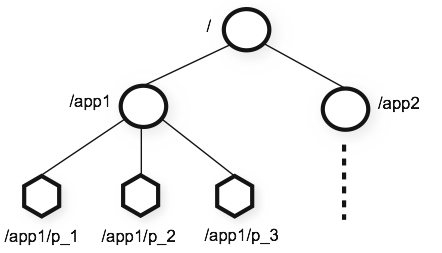
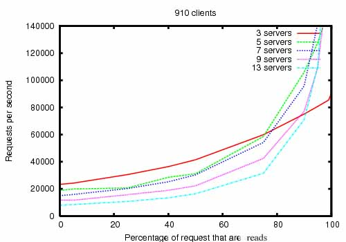

# zookeeper


!!! abstract "官方网站: <https://zookeeper.apache.org/>"

分布式协调服务，在分布式系统中共享配置，协调锁资源，提供命名服务。

下载安装包: <http://archive.apache.org/dist/zookeeper/zookeeper-3.5.7/apache-zookeeper-3.5.7-bin.tar.gz>

## I. QuickStart

### II. Standalone 模式

#### III. 配置文件 conf/zoo.cfg

```
# 心跳, 超时时间为 2 倍, 单位: 毫秒
tickTime=2000

# 存储内存中数据库的快照和数据库更新的事务日志, 修改为 已存在的 空 目录
dataDir=/var/lib/zookeeper
# 为数据库事务日志使用专有的目录
dataLogDir=/var/log/zookeeper

# 客户端连接端口
clientPort=2181
```

#### III. 启动

```sh
bin/zkServer.sh start

/var/lib/zookeeper/
├── version-2
│   └── snapshot.0
└── zookeeper_server.pid

1 directory, 2 files
```

#### III. 连接

```sh
bin/zkCli.sh -server 127.0.0.1:2181
[zk: 127.0.0.1:2181(CONNECTED) 0]

# 列表
[zk: 127.0.0.1:2181(CONNECTED) 2] ls /
[zookeeper]
# 或使用 ls -s
# watch: ls -w
# 递归显示所有子节点
ls -R /path

# 创建
# 持久节点
[zk: 127.0.0.1:2181(CONNECTED) 3] create /zk_test my_data
Created /zk_test
[zk: 127.0.0.1:2181(CONNECTED) 4] ls /
[zk_test, zookeeper]
# 临时节点
create -e /ephemeral_node mydata
# 持久顺序节点
create -s /persistent_sequential_node mydata
# 临时顺序节点
create -s -e /ephemeral_sequential_node mydata

# 查询
[zk: 127.0.0.1:2181(CONNECTED) 5] get /zk_test
my_data
[zk: 127.0.0.1:2181(CONNECTED) 7] stat /zk_test
cZxid = 0x2
ctime = Fri Sep 04 15:41:31 CST 2020
mZxid = 0x2
mtime = Fri Sep 04 15:41:31 CST 2020
pZxid = 0x2
cversion = 0
dataVersion = 0
aclVersion = 0
ephemeralOwner = 0x0
dataLength = 7
numChildren = 0
# 或使用 get -s
# watch: get -w

# 修改
[zk: 127.0.0.1:2181(CONNECTED) 8] set /zk_test junk
WATCHER::
WatchedEvent state:SyncConnected type:NodeDataChanged path:/zk_test

# 删除
[zk: 127.0.0.1:2181(CONNECTED) 10] delete /zk_test
[zk: 127.0.0.1:2181(CONNECTED) 11] ls /
[zookeeper]
```

!!! warning "触发 watch 时, watch 将被删除。3.6.0 中可以设置永久递归监视。"

!!! quote "官方指导: <https://zookeeper.apache.org/doc/current/zookeeperStarted.html>"


### II. 集群模式

1. 在 zoo.cfg 中添加

    ``` hl_lines="11 13 17 18 19"
    # 心跳, 超时时间为 2 倍, 单位: 毫秒
    tickTime=2000

    # 存储内存中数据库的快照和数据库更新的事务日志, 修改为 已存在的 空 目录
    dataDir=/var/lib/zookeeper

    # 客户端连接端口
    clientPort=2181

    # 初始同步阶段心跳次数: 5 x 2000 = 10 seconds
    initLimit=5
    # 发送请求接收响应心跳次数
    syncLimit=2

    # 2888: Follower 与 Leader 进行通信和数据同步
    # 3888: Leader 选举
    server.1=IP1:2888:3888
    server.2=IP2:2888:3888
    server.3=IP3:2888:3888
    ```

1. 在每台机器的 dataDir 目录下创建 **myid** 文件，文件内容即为该机器对应的 Server ID 数字

!!! quote "[如何构建一个高可用ZooKeeper集群？](https://mp.weixin.qq.com/s?subscene=3&__biz=MzU0MTcxMDYxNA==&mid=2247484927&idx=1&sn=7608cf30b2124fd621250c095c36c7f8&chksm=fb248586cc530c908ad8b34ca51037c5f2c0767338b6860ed9ae5314b84be96f29a24ba68ba1&scene=7&ascene=65&devicetype=android-28&version=27000f51&nettype=WIFI&abtest_cookie=AAACAA%3D%3D&lang=zh_CN&exportkey=AX3IWNSpjgoGFSs%2B%2Be29uLM%3D&pass_ticket=1K02ShOaEGYDYdy3bxfJ9NUTimqiZKZaZFZbFrdn5ITp4UxAjC64%2F7w%2B2RX009bF&wx_header=1)"


## I. 架构


{==主从==} 结构，支持 {==数千==} 台服务器

- 写：转发到主结点，同步到从结点
- 读：任意从结点

客户端以 TCP 方式连接到其中一台服务器, 发送请求, 获取响应, 监视数据, 发送心跳, 如果服务器中断, 则连接到其他服务器。

!!! warning
    - 适用于 {==读多写少==} 的场景(约10:1)
    - 只用来存储少量状态和配置信息，不适合大规模业务数据，每个结点数据在 byte 到 kilobyte 范围，{==最大 1M==}。

## I. 数据存储方式



以目录方式存储数据，类似文件系统，数据结点叫做 {==znode==}，但每个节点都可以 **存储数据**。

数据保存在 {==内存==} 中。更新日志将先序列化到磁盘, 再应用到内存。

数据存储 {==有序==}, 原子, 一致, 可靠, 及时。

!!! example "Znode"
    - data
    - child
    - ACL: 每个 znode 通过访问控制列表设置权限
    - stat
        - cZxid = 0x2: 创建 ID, 结点任何状态变化都会导致 ZooKeeper 事务 ID 的增加
        - ctime = Sun Sep 06 17:31:08 CST 2020: 创建时间
        - mZxid = 0x8: 最后一次修改 ID
        - mtime = Sun Sep 06 21:09:21 CST 2020: 最后一次修改时间
        - pZxid = 0x2: 子结点最后一次修改 ID
        - cversion = 0: 子结点更改
        - dataVersion = 4: 数据更改
        - aclVersion = 0: ACL 更改
        - ephemeralOwner = 0x0: 临时结点 owner 的 session ID, 非临时结点为 0
        - dataLength = 1: 数据大小
        - numChildren = 0: 子结点数量

## I. API

- create
- delete
- exists
- getData
- setData
- getChildren
- sync

!!! tip "提示"
    在读操作上可以设置watch，在znode上注册触发器，当数据改变时触发事件，异步通知。

## I. 性能基线



- dual 2Ghz Xeon, 2 SATA 15K RPM(一个用于操作系统和内存数据库快照, 一个专用于数据库事务日志)
- 读写比例 10:1 时性能最优, 每秒达到 14 万请求数(数据大小 1K)
- 与服务器数量相关不大

## I. 可靠性

- follower 可以快速恢复
- leader 重新选举小于 200ms

## 集群架构

ZAB(ZooKeeper Atomic Broadcast)协议保证一致性，类似Paxos和Raft，单调一致性，依靠事务ID和版本号保证读写有序

- 崩溃恢复
    1. 选举：所有节点处于Looking状态，投票(ID, ZXID)，如果别人ZXID大，重新投给它。得票半数以上成为准Leader，转换为leading状态，其他成为following状态。
    2. 发现：所有从节点将最新的ZXID和事务日志发送给Leader，Leader将最大的epoch+1发给各follower，follower返回ACK和历史事务日志。
    3. 同步：将最新的历史事务日志同步给所有follower，半数以上同步成功。
- 主从数据同步
    - 客户端写请求发送给follower --> 转发给leader --> 广播propose消息给follower --> follower写日志并返回ACK --> Leader收到半数以上ACK，返回成功给客户端 --> 广播commit

!!! note "结点状态"
    - looking选举状态
    - following从结点
    - leading主结点

!!! note "最大ZXID"
    - 结点本地最新事务编号
        - epoch
        - 计数


## 应用

- 分布式锁，类似还有
    - memcached add
    - redis setnx
    - Chubby paxos算法
- 服务注册和发现，如阿里的RPC框架Dubbo
- 共享配置和状态信息，如Redis, Kafka, HBase, Hadoop

### zookeeper实现分布式锁

#### 结点类型

- 持久结点persistant
- 持久结点顺序结点persistant_sequential，根据创建时间给结点编号
- 临时结点ephemeral，创建结点的客户端断开后结点自动删除
- 临时顺序结点

3.6.0 版本以后添加了

- 容器结点
- TTL 结点

#### 分布式锁

1. 获取锁：创建持久结点parentlock，创建临时顺序结点lock1，判断是第一个，获得锁，否，watch前一个结点。
1. 释放锁：
    - 删除lock1。
    - 断开自动删除

!!! quote "框架实现"
    apache curator

### redis实现分布式锁

1. 加锁：`setnx(key, 1)` --> `set(key, 1, 30, NX)` --> `threadid = Thread.currentThread.getid(); set(key, threadid, 30, NX)`删除前判断是否自己的线程ID防止误删（使用lua脚本实现原子性）
1. 解锁：`del(key)`
1. 锁超时：`expire(key, 30)`，{>>获得锁后，可以另外启动守护线程自动续期<<}
