# 0x02_neutron

## 功能

- 二层交换Switching: Nova的Instance通过 {==虚拟交换机==} 连接到虚拟二层网络。  
    - 虚拟交换机
        - Linux Bridge
        - Open vSwitch(OVS)，开源
    - 利用虚拟交换机创建
        - VLAN
        - 基于隧道的Overlay网络
            - VxLAN
            - GRE(Linux Bridge不支持)
- 三层路由Routing: 通过 {==虚拟路由器==} 使不同网段的instance之间，以及与外部网络通信。
    - 虚拟路由器router: 通过IP forwarding, iptables实现路由和NAT。
- 负载均衡Load balancing(LBaaS): 将负载分发到多个instance。
    - HAProxy
- 防火墙Firewalling
    - security group: 通过iptables限制进出instance的网络数据包
    - FWaaS: 通过iptables限制进出虚拟路由器的网络数据包

## 网络资源

### network

二层广播域，在project下创建多个network。

- local: 单机lo, 同一节点上同一网络的instance通信
- flat: 无VLAN tagging, 同一网络跨节点通信
- VLAN: 具有802.1q tagging, 跨节点
- VxLAN: 唯一标识segmentation ID(VNI)，二层数据包封装成UDP包在三层传输
- GRE: 使用IP包封装

### subnet

IP地址段，一个network有多个subnet。

### port

虚拟交换机上的端口，定义IP和MAC。instance的虚拟网卡VIF(Virtual Interface)绑定到port时分配IP和MAC。一个subnet有多个port。

!!! abstract "映射关系"
    project **1:n** network **1:n** subnet **1:n** port **1:1** VIF **n:1** instance


???+ quote "已读"
    - [Neutron 功能概述 - 每天5分钟玩转 OpenStack（65）](https://mp.weixin.qq.com/s?__biz=MzIwMTM5MjUwMg==&mid=2653587695&idx=1&sn=17a595f7225b1cf3bb5e6b6879d6d005&chksm=8d3080f6ba4709e0692ec0c9f26f4832c0ccf92b9f77b7f7c375a80940ec107aefb7fe9d9aee&scene=21#wechat_redirect)
    - [Neutron 网络基本概念 - 每天5分钟玩转 OpenStack（66）](https://mp.weixin.qq.com/s?__biz=MzIwMTM5MjUwMg==&mid=2653587708&idx=1&sn=f7dea80905f19bf460e1aa67c5d2453f&chksm=8d3080e5ba4709f3f934ec4dd099a14f1641b0b200b2f4e2dc27ad39cbc9c58447d46436dc0d&scene=21#wechat_redirect)


## Linux Bridge

1. 配置Neutron使用ML2作为core plugin: `/etc/neutron/neutron.conf`

    

    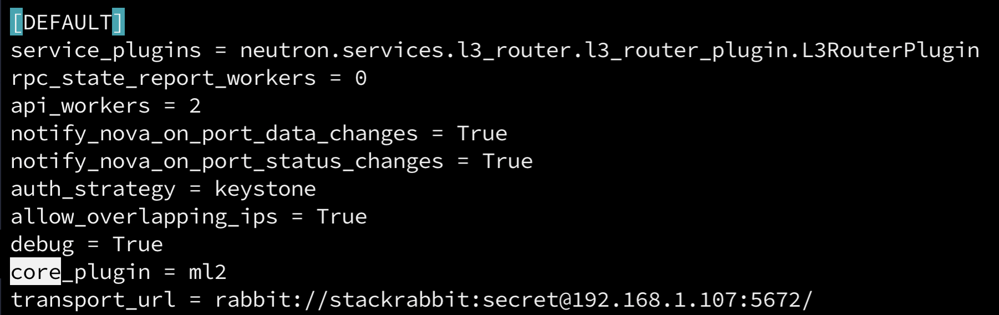

    > 控制节点和计算节点都要配置

1. 配置ML2使用linux-bridge mechanism driver: `/etc/neutron/plugins/ml2/ml2_conf.ini`

    

    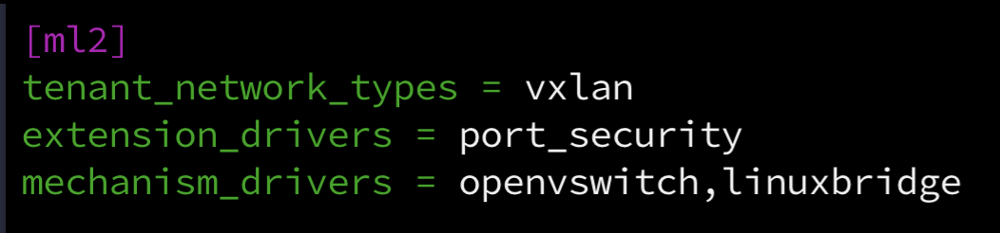

    > 控制节点和计算节点都要配置; 可配置多个

1. 重启Neutron服务, 查看neutron-linuxbridge-agent进程: `$ ps -efw | grep -v grep | grep neutron-linuxbridge-agent`

    


### 网络设备

- tap interface: tap0...
- linux bridge: brqXXXX
- vlan interface: ethX.Y
- vxlan interface: vxlan-Z
- 物理interface: ethX

### local network

> 不会与宿主机任何物理网卡相连, 只可在 {==同一节点上==} 连接到 {==相同bridge==} 的instance之间通信


1. 配置ML2加载local type driver: `/etc/neutron/plugins/ml2/ml2_conf.ini`

    

    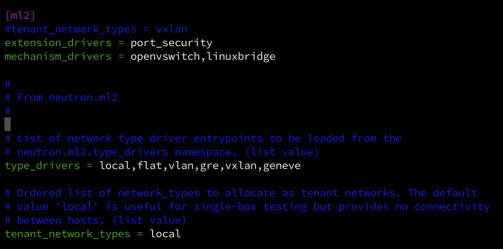

1. 配置默认创建的网络类型tenant_network_types, {>>可以指定多种, 按优先级排序<<}
1. 重启Neutron服务
1. 通过Web GUI创建local network
    - Project - Network - Networks
    - Admin - Networks, 通过admin创建network可以指定:
        - 所属project
        - network type
        - 是否与其他project共享
        - 是否为external network

1. ifconfig -a查看网络接口
    - lo
    - enp0s3
    - enp0s8
    - enp0s9
    - brqa2fc38ff-53
    - tapcdee5c64-7d
    - tapef270cce-79
    - virbr0
    - virbr0-nic
    - br-ex

1. 查看linux bridge状态: `{==brctl show==}`, 已创建brqXXX和tapXXX(DHCP interface)

    ```bash
    $ brctl show
    bridge name     bridge id               STP enabled     interfaces
    brqa2fc38ff-53  8000.7e759c59ff32       no              tapcdee5c64-7d
                                                            tapef270cce-79
    virbr0          8000.525400c2314c       yes             virbr0-nic
    ```

1. 将instance连接到local network, 查看subnet中新增一个port(IP, MAC), 并将port attach到instance

    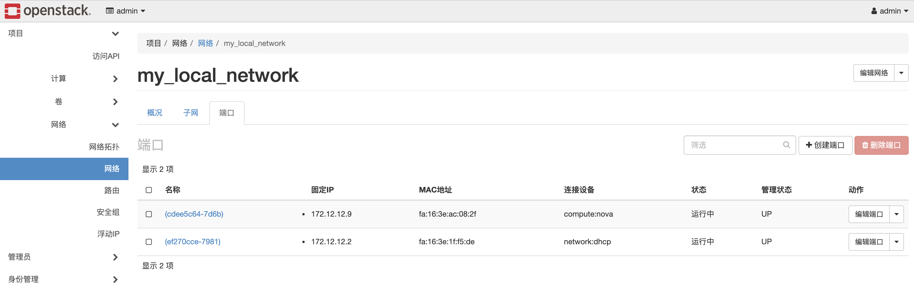

1. VM启动时, 宿主机上的neutron-linuxbridge-agent根据port信息创建tap设备, 并连接到local bridge上, 同时该tap映射成VM的虚拟网卡VIF

    ```bash
    $ virsh list --all
     Id    Name                           State
    ----------------------------------------------------
     1     instance-00000001              running

    $ virsh domiflist instance-00000001
    Interface  Type       Source     Model       MAC
    -------------------------------------------------------
    tapcdee5c64-7d bridge     brqa2fc38ff-53 virtio      fa:16:3e:ac:08:2f
    ```


### flat network

!!! note "不带tag的网络, Linux Bridge与物理网卡连接, 每个flat {==独占一个网卡==}"

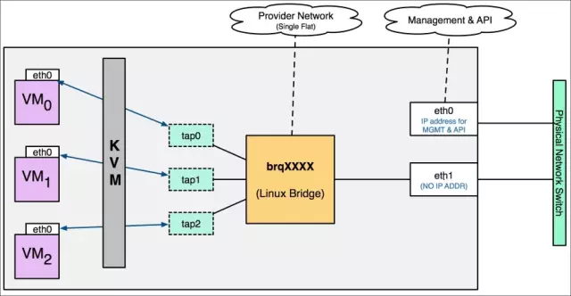

1. 配置租户网络类型

    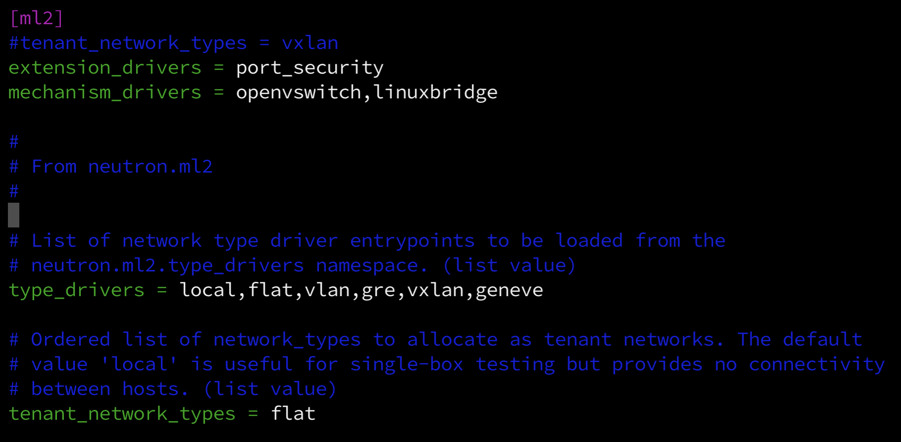

1. 配置flat网络与物理网卡的对应关系

    ```
    [ml2_type_flat]
    flat_networks = default[,flat2]

    [linux_bridge]
    physical_interface_mappings = default:enp0s8[,flat2:eth2]
    ```

1. 创建flat网络和子网

    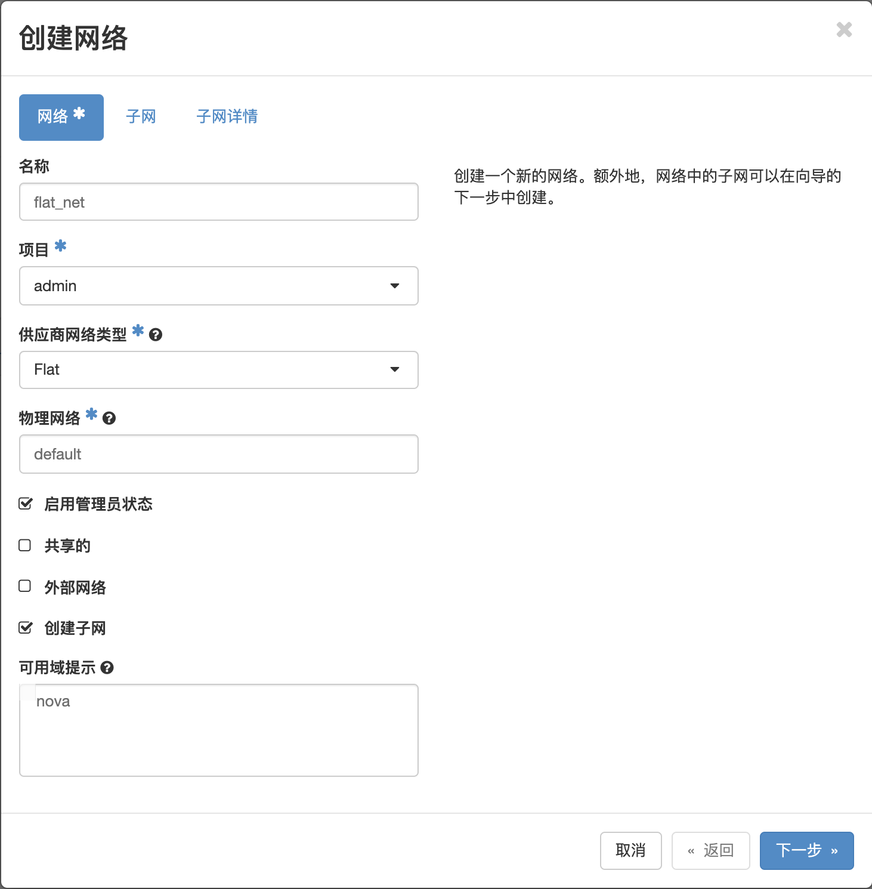

    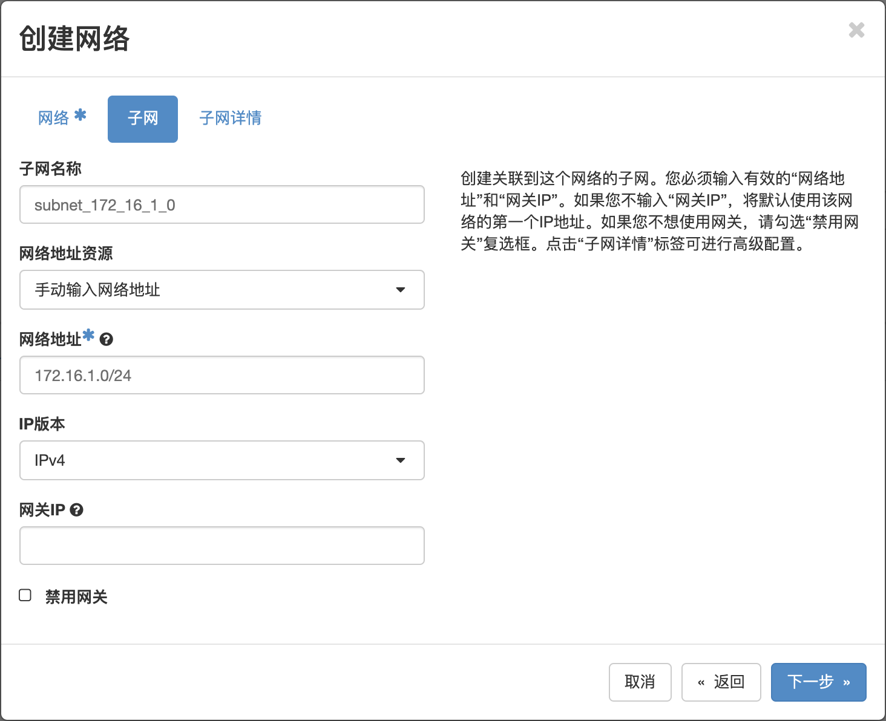

    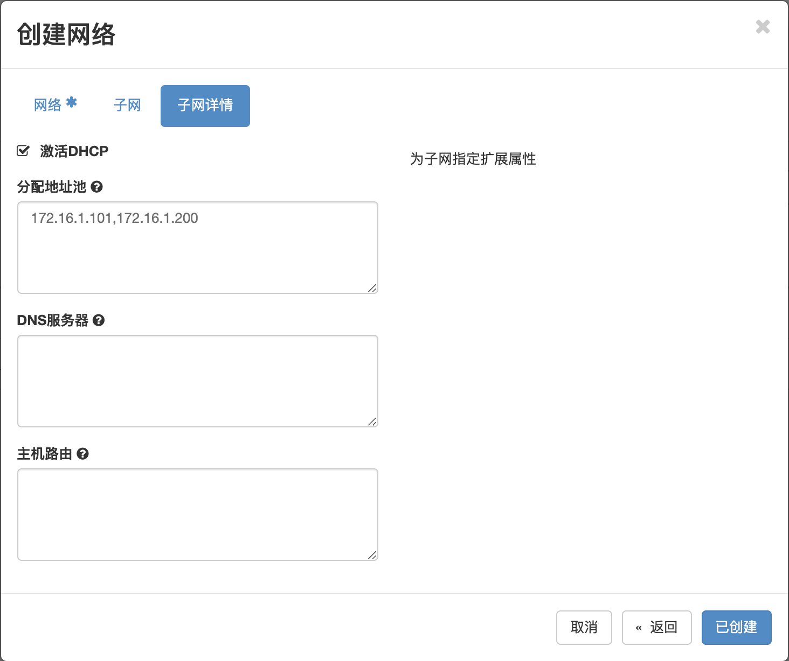

    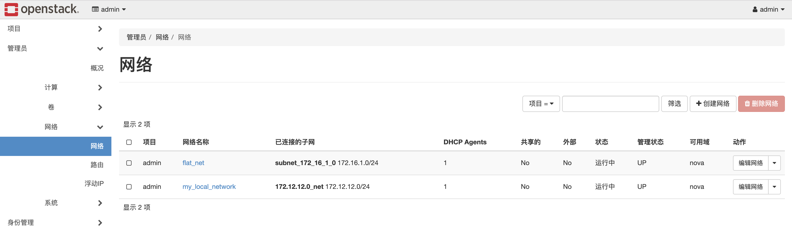

    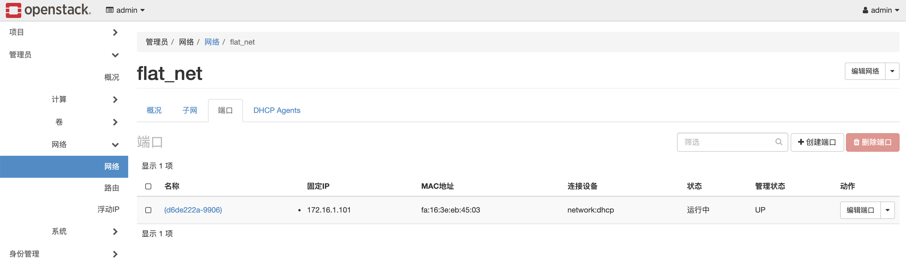

1. ifconfig查看新增加`brq9b013c6f-5d`和`tapd6de222a-99`

    ```bash hl_lines="3 4"
    $ brctl show
    bridge name     bridge id               STP enabled     interfaces
    brq9b013c6f-5d          8000.080027f23a45       no      enp0s8
                                                            tapd6de222a-99
    brqa2fc38ff-53          8000.7e759c59ff32       no      tapcdee5c64-7d
                                                            tapef270cce-79
    virbr0          8000.525400c2314c       yes             virbr0-nic
    ```

1. 部署instance

    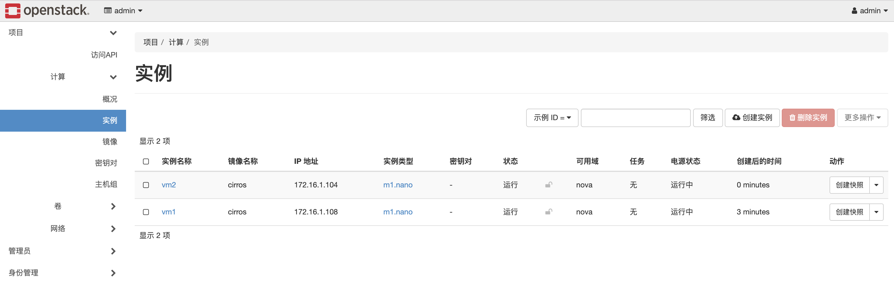

    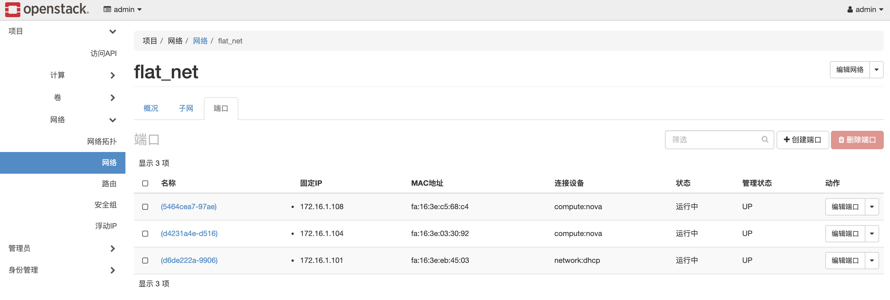

    ```bash
    $ brctl show
    bridge name     bridge id               STP enabled     interfaces
    br-ex           8000.000000000000       no
    brq9b013c6f-5d          8000.080027f23a45       no              enp0s8
                                                            tap45bde37b-49
                                                            tap5464cea7-97
                                                            tapd4231a4e-d5
                                                            tapd6de222a-99
    virbr0          8000.525400c2314c       yes             virbr0-nic
    ```

> 控制节点和计算节点上的网桥名称相同


!!! quote "已读"
    - [配置 linux-bridge mechanism driver - 每天5分钟玩转 OpenStack（77）](https://mp.weixin.qq.com/s?__biz=MzIwMTM5MjUwMg==&mid=2653587658&idx=1&sn=ba38096b11bd93a7fa596cd1a1696d82&chksm=8d3080d3ba4709c5f492c01d7e150ad9e738b1058a9d1c2671cd04fcb56a6244832485590ab8&scene=21#wechat_redirect)
    - [实践 Neutron 前的两个准备工作 - 每天5分钟玩转 OpenStack（78）](https://mp.weixin.qq.com/s?__biz=MzIwMTM5MjUwMg==&mid=2653587656&idx=1&sn=b84065f7d5dd1ae32eacf2aad4b93156&chksm=8d3080d1ba4709c7030032a386e1ffe7d0eedd377c2fa90a1b4584832c35932f5893339ec3c5&scene=21#wechat_redirect)
    - [在 ML2 中 enable local network - 每天5分钟玩转 OpenStack（79）](https://mp.weixin.qq.com/s?__biz=MzIwMTM5MjUwMg==&mid=2653587652&idx=1&sn=ba29d242fe90a328e3fb6011548e15bb&chksm=8d3080ddba4709cb44947f2b9cd85658e37cb21803f8e05bb844de6275e0513a457596c878e2&scene=21#wechat_redirect)
    - [创建第一个 local network（I） - 每天5分钟玩转 OpenStack（80）](https://mp.weixin.qq.com/s?__biz=MzIwMTM5MjUwMg==&mid=2653587643&idx=1&sn=7ad568889d9f44c77d7c8e45a8fb33ff&chksm=8d3080a2ba4709b4d4f26cf38f65fda3a250f2b3eebc4bb1b7d50828107f9c80cc67055cce1a&scene=21#wechat_redirect)
    - [创建第一个 local network（II）- 每天5分钟玩转 OpenStack（81）](https://mp.weixin.qq.com/s?__biz=MzIwMTM5MjUwMg==&mid=2653587642&idx=1&sn=26090fbdeea9a3814574f35229715050&chksm=8d3080a3ba4709b5ef186bd45dca532beae37d4a75d8cdaef0c6cd31fbaf34bb2f76fdb3b953&scene=21#wechat_redirect)
    - [将 instance 连接到 first_local_net - 每天5分钟玩转 OpenStack（82）](https://mp.weixin.qq.com/s?__biz=MzIwMTM5MjUwMg==&mid=2653587630&idx=1&sn=4c9495f74f3360c5ef81e73af5122eec&chksm=8d3080b7ba4709a13f4f78247c8ba23b6bd17963b99bf0a7165f195b36c19d3e09baa8dd8853&scene=21#wechat_redirect)
    - [连接第二个 insance 到 first_local_net - 每天5分钟玩转 OpenStack（83）](https://mp.weixin.qq.com/s?__biz=MzIwMTM5MjUwMg==&mid=2653587628&idx=1&sn=b9777c3c831bde12fe95cc9932750069&chksm=8d3080b5ba4709a35ecc0a291a9daaee86addf4822e38340abd7d92f27a9ca860eed0b5abacf&scene=21#wechat_redirect)
    - [创建第二个 local network - 每天5分钟玩转 OpenStack（84）](https://mp.weixin.qq.com/s?__biz=MzIwMTM5MjUwMg==&mid=2653587624&idx=1&sn=66b9ce938085f8553809d3a22a91eac2&chksm=8d3080b1ba4709a75948b8955e019c292383d48200568d4d68e6fc684e0dfe65b76dc9936ce9&scene=21#wechat_redirect)
    - [将 instance 连接到 second_local_net - 每天5分钟玩转 OpenStack（85）](https://mp.weixin.qq.com/s?__biz=MzIwMTM5MjUwMg==&mid=2653587620&idx=1&sn=70df7f16556e3463476a3ddd0134eb1b&chksm=8d3080bdba4709abe01f33aecf317a8e14b750342a17264966f59c6ab38e58a2b1e46d2cf50c&scene=21#wechat_redirect)
    - [flat network 原理与配置 - 每天5分钟玩转 OpenStack（86）](https://mp.weixin.qq.com/s?__biz=MzIwMTM5MjUwMg==&mid=2653587616&idx=1&sn=82b34a5dd13596d86db062efab6ef279&chksm=8d3080b9ba4709af68582130b1c0e693653a96a7d61926912260a44b7021ee6b38f423029c91&scene=21#wechat_redirect)
    - [创建 flat network - 每天5分钟玩转 OpenStack（87）](https://mp.weixin.qq.com/s?__biz=MzIwMTM5MjUwMg==&mid=2653587615&idx=1&sn=544293b740f93b7e862a62810035ea23&chksm=8d308086ba4709900bb5087a438336dd6e8388ef35f1fd752695b54d33e626f64690bd818304&scene=21#wechat_redirect)
    - [将 instance 连接到 flat_net - 每天5分钟玩转 OpenStack（88）](https://mp.weixin.qq.com/s?__biz=MzIwMTM5MjUwMg==&mid=2653587611&idx=1&sn=1ef6ccab139e541ffc65d1c3a0c6ec11&chksm=8d308082ba47099463fcf359c0f315dccf41e4d165644f58192b3eed9255d04296862f5312e3&scene=21#wechat_redirect)


## DHCP

配置文件: `/etc/neutron/dhcp_agent.ini`

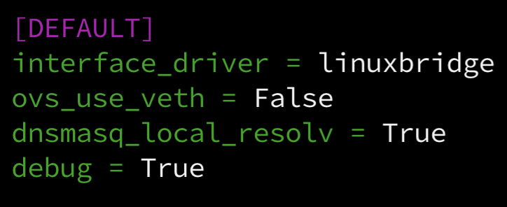

> 使用linux bridge连接DHCP namespace interface

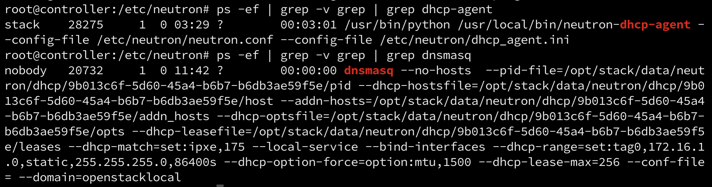

当创建network并在subnet上enable DHCP时, 网络节点上的DHCP agent会启动dnsmasq进程(与network一对一, 对应配置目录`/opt/stack/data/neutron/dhcp/{ID}`)

- host: instance与IP/MAC对应关系
- interface: 绑定的tap设备

```bash
$ pwd
/opt/stack/data/neutron/dhcp/9b013c6f-5d60-45a4-b6b7-b6db3ae59f5e

$ ll
total 32
drwxr-xr-x 2 stack  stack   4096 Sep  7 12:14 ./
drwxr-xr-x 3 stack  stack   4096 Sep  7 11:42 ../
-rw-r--r-- 1 stack  stack    256 Sep  7 11:42 addn_hosts
-rw-r--r-- 1 stack  stack    256 Sep  7 11:42 host
-rw-r--r-- 1 stack  stack     14 Sep  7 11:42 interface
-rw-r--r-- 1 stack  stack    248 Sep  7 11:42 leases
-rw-r--r-- 1 stack  stack     33 Sep  7 11:42 opts
-rw-r--r-- 1 nobody nogroup    6 Sep  7 11:42 pid

$ cat host
fa:16:3e:71:e7:90,host-172-16-1-105.openstacklocal,172.16.1.105
fa:16:3e:c5:68:c4,host-172-16-1-108.openstacklocal,172.16.1.108
fa:16:3e:03:30:92,host-172-16-1-104.openstacklocal,172.16.1.104
fa:16:3e:eb:45:03,host-172-16-1-101.openstacklocal,172.16.1.101

$ cat interface
ns-d6de222a-99
```

> dnsmasq是一个提供DHCP和DNS服务的开源软件

### Linux Network Namespace

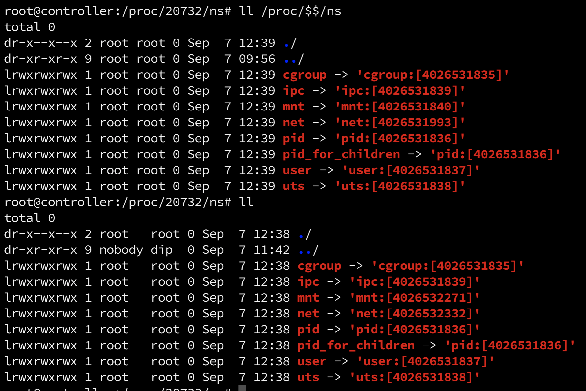


!!! quote "已读"
    - [配置 DHCP 服务 - 每天5分钟玩转 OpenStack（89）](https://mp.weixin.qq.com/s?__biz=MzIwMTM5MjUwMg==&mid=2653587607&idx=1&sn=6eaeb88edd1f82fe03c69c78ca4d4455&chksm=8d30808eba470998dcdd9e8f66b492215ec054d89dcbf0b43e52064aa54d0b9ac83c36cce5ff&scene=21#wechat_redirect)


## Open vSwitch

1. 安装Open vSwitch agent

    ```bash
    $ vim local.conf
    Q_AGENT=openvswitch
    ```

    重新运行`./stack`

1. 配置ML2使用openvswitch mechanism driver:

    ```bash
    $ vim /etc/neutron/plugins/ml2/ml2_conf.ini
    mechanism_drivers = openvswitch
    ```

    > 控制节点和计算节点都要配置

1. 重启Neutron服务, 查看agent运行状态: `{==neutron agent-list==}`

### 初始网络状态

??? info "Linux Bridge初始没有br"
    参考[实践 Neutron 前的两个准备工作 - 每天5分钟玩转 OpenStack（78）](https://mp.weixin.qq.com/s?__biz=MzIwMTM5MjUwMg==&mid=2653587656&idx=1&sn=b84065f7d5dd1ae32eacf2aad4b93156&chksm=8d3080d1ba4709c7030032a386e1ffe7d0eedd377c2fa90a1b4584832c35932f5893339ec3c5&scene=21#wechat_redirect)

- br-ex: 连接外部(external)网络
- br-int: 集成(integration)网桥, 连接所有instance的虚拟网卡
- br-tun: 隧道(tunnel)网桥, VxLAN和GRE网络使用

使用`{==ovs-vsctl show==}`查看

### 网络设备

- tap interface: tapXXX
- linux bridge: qbrXXX
- veth pair: qvbXXX, qvoXXX
- OVS integration bridge: br-int
- OVS patch ports: int-br-ethX, phy-br-ethX
- OVS provider bridge: br-ethX
- 物理interface: ethX
- OVS tunnel bridge: br-tun

### local network

1. 通过Web GUI创建local network
1. 查看Open vSwitch的状态: `{==ovs-vsctl show==}`, 已创建tapXXX(DHCP interface)并挂载到br-int上
1. 将instance连接到local network, 查看subnet中新增一个port(IP, MAC), 并将port attach到instance
1. VM启动时, 宿主机上的neutron-openvswitch-agent根据port信息创建tap设备, 并 **创建Linux Bridge设备qbrXXX和veth pair连接br-int(qvoXXX)和qbrXXX(qvbXXX), tap连接到qbrXXX上,** 同时该tap映射成VM的虚拟网卡VIF

    > 为了支持iptables规则实现Security Group功能

!!! tip "使用`ethtool -S qvbXXX`查看statistics显示peer_ifindex"

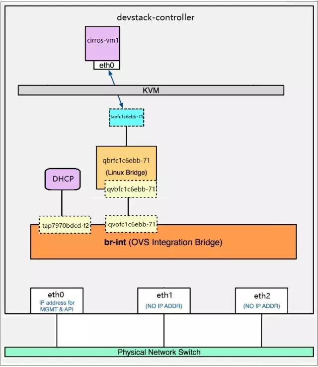


!!! quote "已读"
    - [启用 Open vSwitch - 每天5分钟玩转 OpenStack（127）](https://mp.weixin.qq.com/s?__biz=MzIwMTM5MjUwMg==&mid=2653587478&idx=1&sn=46ab66e055b542780e09fff83b1e9431&chksm=8d30800fba4709191b8d686375df191cc59776b0ed516bf15c8ab13fccb9e99094203428e1f5&scene=21#wechat_redirect)
    - [OVS 中的各种网络设备 - 每天5分钟玩转 OpenStack（128）](https://mp.weixin.qq.com/s?__biz=MzIwMTM5MjUwMg==&mid=2653587472&idx=1&sn=fd2522441a678b25387da1f965b897d7&chksm=8d308009ba47091f8dd101b84d41567b00292fea43edda1a03dac67e2680e225b766e83b1b88&scene=21#wechat_redirect)
    - [创建 OVS Local Network - 每天5分钟玩转 OpenStack（129）](https://mp.weixin.qq.com/s?__biz=MzIwMTM5MjUwMg==&mid=2653587469&idx=1&sn=0efe77289bd315522bdcc1618db635b2&chksm=8d308014ba47090278b9f132432c11155e1b817f1105bb196bb12aef04abb5f4f2ee309be043&scene=21#wechat_redirect)
    - [将 instance 部署到 OVS Local Network - 每天5分钟玩转 OpenStack（130）](https://mp.weixin.qq.com/s?__biz=MzIwMTM5MjUwMg==&mid=2653587458&idx=1&sn=df59107c4820d575ea02b049513c56a3&chksm=8d30801bba47090d62d0cac15bbd0cdc149e8c10a694ce199215cdad498194e00b7b40cb8b01&scene=21#wechat_redirect)
