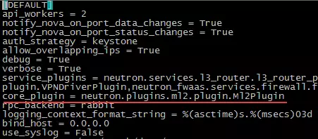
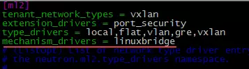
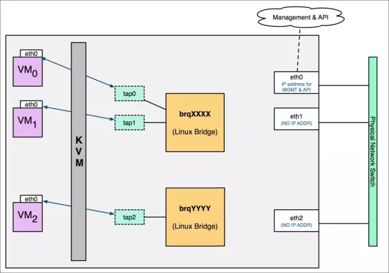
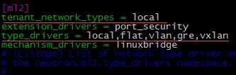

# 0x02_neutron

## 功能

- 二层交换Switching: Nova的Instance通过 {==虚拟交换机==} 连接到虚拟二层网络。  
    - 虚拟交换机
        - Linux Bridge
        - Open vSwitch(OVS)，开源
    - 利用虚拟交换机创建
        - VLAN
        - 基于隧道的Overlay网络
            - VxLAN
            - GRE(Linux Bridge不支持)
- 三层路由Routing: 通过 {==虚拟路由器==} 使不同网段的instance之间，以及与外部网络通信。
    - 虚拟路由器router: 通过IP forwarding, iptables实现路由和NAT。
- 负载均衡Load balancing(LBaaS): 将负载分发到多个instance。
    - HAProxy
- 防火墙Firewalling
    - security group: 通过iptables限制进出instance的网络数据包
    - FWaaS: 通过iptables限制进出虚拟路由器的网络数据包

## 网络资源

### network

二层广播域，在project下创建多个network。

- local: 单机lo, 同一节点上同一网络的instance通信
- flat: 无VLAN tagging, 同一网络跨节点通信
- VLAN: 具有802.1q tagging, 跨节点
- VxLAN: 唯一标识segmentation ID(VNI)，二层数据包封装成UDP包在三层传输
- GRE: 使用IP包封装

### subnet

IP地址段，一个network有多个subnet。

### port

虚拟交换机上的端口，定义IP和MAC。instance的虚拟网卡VIF(Virtual Interface)绑定到port时分配IP和MAC。一个subnet有多个port。

!!! abstract "映射关系"
    project **1:n** network **1:n** subnet **1:n** port **1:1** VIF **n:1** instance

???+ quote "已读"
    - [Neutron 功能概述 - 每天5分钟玩转 OpenStack（65）](https://mp.weixin.qq.com/s?__biz=MzIwMTM5MjUwMg==&mid=2653587695&idx=1&sn=17a595f7225b1cf3bb5e6b6879d6d005&chksm=8d3080f6ba4709e0692ec0c9f26f4832c0ccf92b9f77b7f7c375a80940ec107aefb7fe9d9aee&scene=21#wechat_redirect)
    - [Neutron 网络基本概念 - 每天5分钟玩转 OpenStack（66）](https://mp.weixin.qq.com/s?__biz=MzIwMTM5MjUwMg==&mid=2653587708&idx=1&sn=f7dea80905f19bf460e1aa67c5d2453f&chksm=8d3080e5ba4709f3f934ec4dd099a14f1641b0b200b2f4e2dc27ad39cbc9c58447d46436dc0d&scene=21#wechat_redirect)

## Linux Bridge

1. 配置Neutron使用ML2作为core plugin: `/etc/neutron/neutron.conf`

    

    > 控制节点和计算节点都要配置

1. 配置ML2使用linux-bridge mechanism driver: `/etc/neutron/plugins/ml2/ml2_conf.ini`

    

    > 控制节点和计算节点都要配置; 可配置多个

1. 重启Neutron服务, 查看neutron-linuxbridge-agent进程: `$ ps -efw | grep -v grep | grep neutron-linuxbridge-agent`

### 网络设备

- tap interface: tap0...
- linux bridge: brqXXXX
- vlan interface: ethX.Y
- vxlan interface: vxlan-Z
- 物理interface: ethX

### local network

> 不会与宿主机任何物理网卡相连, 只可在连接到相同bridge的instance之间通信

1. 配置ML2加载local type driver: `/etc/neutron/plugins/ml2/ml2_conf.ini`

    

1. 配置默认创建的网络类型tenant_network_types, {>>可以指定多种, 按优先级排序<<}
1. 重启Neutron服务
1. 通过Web GUI创建local network
    - Project - Network - Networks
    - Admin - Networks

    !!! todo "在环境中实操"
        - [创建第一个 local network（I） - 每天5分钟玩转 OpenStack（80）](https://mp.weixin.qq.com/s?__biz=MzIwMTM5MjUwMg==&mid=2653587643&idx=1&sn=7ad568889d9f44c77d7c8e45a8fb33ff&chksm=8d3080a2ba4709b4d4f26cf38f65fda3a250f2b3eebc4bb1b7d50828107f9c80cc67055cce1a&scene=21#wechat_redirect)

1. 查看linux bridge状态: `{==brctl show==}`, 已创建brqXXX和tapXXX(DHCP interface)

!!! quote "已读"
    - [配置 linux-bridge mechanism driver - 每天5分钟玩转 OpenStack（77）](https://mp.weixin.qq.com/s?__biz=MzIwMTM5MjUwMg==&mid=2653587658&idx=1&sn=ba38096b11bd93a7fa596cd1a1696d82&chksm=8d3080d3ba4709c5f492c01d7e150ad9e738b1058a9d1c2671cd04fcb56a6244832485590ab8&scene=21#wechat_redirect)
    - [实践 Neutron 前的两个准备工作 - 每天5分钟玩转 OpenStack（78）](https://mp.weixin.qq.com/s?__biz=MzIwMTM5MjUwMg==&mid=2653587656&idx=1&sn=b84065f7d5dd1ae32eacf2aad4b93156&chksm=8d3080d1ba4709c7030032a386e1ffe7d0eedd377c2fa90a1b4584832c35932f5893339ec3c5&scene=21#wechat_redirect)
    - [在 ML2 中 enable local network - 每天5分钟玩转 OpenStack（79）](https://mp.weixin.qq.com/s?__biz=MzIwMTM5MjUwMg==&mid=2653587652&idx=1&sn=ba29d242fe90a328e3fb6011548e15bb&chksm=8d3080ddba4709cb44947f2b9cd85658e37cb21803f8e05bb844de6275e0513a457596c878e2&scene=21#wechat_redirect)
    - [创建第一个 local network（II）- 每天5分钟玩转 OpenStack（81）](https://mp.weixin.qq.com/s?__biz=MzIwMTM5MjUwMg==&mid=2653587642&idx=1&sn=26090fbdeea9a3814574f35229715050&chksm=8d3080a3ba4709b5ef186bd45dca532beae37d4a75d8cdaef0c6cd31fbaf34bb2f76fdb3b953&scene=21#wechat_redirect)
