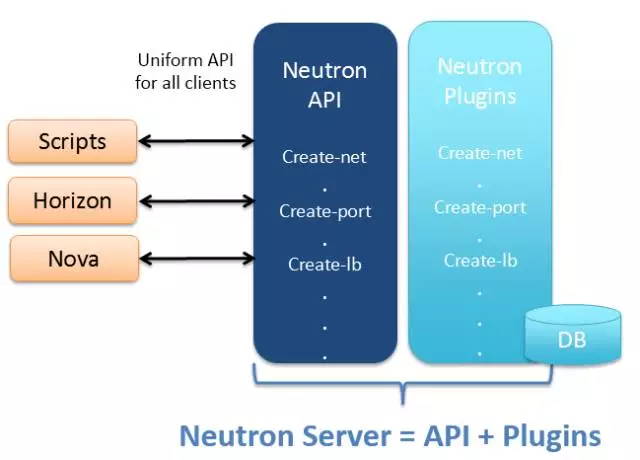
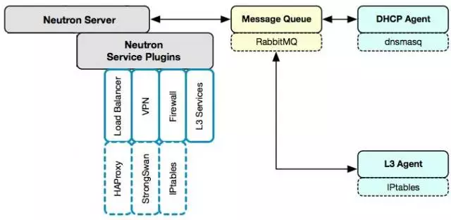
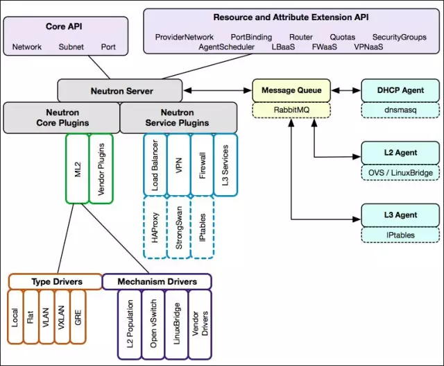

# 0x02_架构

??? abstract "版本"
    

!!! quote "[官方中文文档](https://docs.openstack.org/zh_CN/)"

## keystone

认证和权限管理。

- user: person system service
    - admin, demo, nova, neutron, galance, cinder
- credentials
- authentication
- token
- project: 资源隔离，一个user可以有多个project
- service: nova计算，cinder块存储，swift对象存储，galance镜像，neutron网络
- endpoint: service通过url暴露自己的api。查看endpoint: `openstack catalog list`
- role: 查看角色：`openstack role list`，定义角色权限：`/etc/nova/policy.json`

## galance

管理nova创建VM时使用的镜像。

控制节点galance-api进程转发：
metadata: galance-registry进程，DB: mysql, su - stack, mysql, use galance, show tables
image: store backend
backend配置：etc/galance/galance-api.conf
查看镜像：galance image-list

## nova

管理VM的生命周期。

nova-compute组件安装在计算节点上，安装Hypervisor，上面运行虚拟机。  
nova-其他子服务和rabbitmq, mysql安装在控制节点上。

- 查看子服务分布：`nova service-list`
- 配置Hypervisor driver: `/etc/nova/nova.conf`
- 在keystone中查询nova-api的endpoint: `openstack endpoint show nova`

## neutron

提供网络服务，创建和管理L2, L3网络。

### 组件

- **neutron server:** 对外提供API，接收请求，调用plugin处理请求。

    ??? note "API可以提供给Scripts, Horizon, Nova使用"
        

- **neutron plugins:** 处理server请求，维护逻辑网络状态，调用agent。

    !!! tip "保存网络配置到数据库"
        Neutron实现了[ML2(Modular Layer 2)](#ml2-core-plugin) plugin, 对数据库访问功能进行抽象和封装, 因此provider无需再开发自己的plugin, 只需要针对ML2开发driver即可

    1. core plugin: 维护network, subnet, port, 对应linux bridge, OVS
    1. service plugin: 维护routing, firewall, load balance

- **neutron agents:** 运行在各节点。处理plugin请求，在provider上实现网络功能。

    !!! note "配置provider"

- **network provider:** {==网络设备==}, 如Linux Bridge, Open vSwitch(OVS)或物理交换机。
- **message queue:** server, plugin, agent之间通信。
- **neutron database:** 存放network, subnet, port, router。

    !!! note "查看neutron数据库表"
        1. 在 {==控制节点==} `su - stack`
        1. 执行`mysql`
        1. `use neutron`
        1. `show tables;`

> provider, agent, plugin配套使用

#### 流程示例: 创建一个VLAN=100的network

> 假设network provider是linux bridge

1. Neutron Server接收到创建network的请求，通过Message Queue(RabbitMQ)通知已注册的Linux Bridge Plugin
1. plugin将要创建的network信息（名称，VLAN ID...）保存到数据库，通过queue通知运行在各节点上的Agent
1. agent在节点的物理网卡上创建虚拟VLAN网卡如eth0.100，并创建bridge如brqxxx桥接VLAN设备

#### Neutron Server

- Core API: 对外提供管理network, subnet, port的RESTful API
- Extension API: 对外提供管理router, load balance, firewall的RESTful API
- Common Service: 认证和校验API请求
- Neutron Core: 核心处理程序, 调用plugin
- Core Plugin API: Core通过该API调用plugin
- Extension Plugin API: Core通过该API调用plugin

#### ML2 Core Plugin

> 提供一个框架, 支持不同agent

- type driver: 网络类型, 如: Local, Flat, VLAN, VxLAN, GRE
- mechansim driver: 访问机制, 如: LinuxBridge, OpenvSwitch, L2Population(优化和限制overlay网络中的广播流量)
    - Agent-based: linux bridge, open vswitch
    - Controller-based: OpenDaylight, VMWare NSX
    - 基于物理交换机: Cisco Nexus, Arista, Mellanox

#### Service Plugin / Agent

- DHCP: dhcp agent通过dnsmasq实现
- Routing: l3 agent通过IPtables实现, 创建router, 为subnet之间提供路由
- Firewall: l3 agent通过IPtables实现
    - 在router上配置防火墙策略, 保护所有network
    - Security Group: 在instance上配置安全策略, 保护单个instance
- Load Balance: 通过HAProxy实现, 为多个instance提供load balance服务

!!! note "metadata-agent"
    提供给instance在启动时, 通过dhcp-agent, l3-agent访问nova-metadata-api获取hostname, ip, public key等

### 部署

> 各服务的各组件都可以部署到不同的物理节点上。

1. 控制节点：neutron server（集成core plugin, service plugin）
1. 控制节点或网络节点：core agent, service agent

    !!! note "独立的网络节点实现数据交换, 路由等, 通过增加网络节点承担更大的负载"

1. 计算节点：core agent

## cinder

为VM提供Volume块存储。

## * swift

VM通过RESTful API存放对象数据。

## * ceilometer

监控，告警，计量。

## horizon

portal

!!! quote "已读"
    - [OpenStack 架构 - 每天5分钟玩转 OpenStack（15）](https://mp.weixin.qq.com/s?__biz=MzIwMTM5MjUwMg==&mid=2653587909&idx=1&sn=b1297dc5cb49323a36a367122c1b1c4f&chksm=8d3081dcba4708ca61eacafb9d312e8278cbe380a00f01cc8f7cdba0bc1da1797f90df133051&scene=21#wechat_redirect)
    - [Neutron 架构 - 每天5分钟玩转 OpenStack（67）](https://mp.weixin.qq.com/s?__biz=MzIwMTM5MjUwMg==&mid=2653587691&idx=1&sn=c71b110dade71c3e120ec6b2389b3e33&chksm=8d3080f2ba4709e44eb08c55223e141f7ed0e069ebd6f770b7770665e00ff72d48ce41596a0b&scene=21#wechat_redirect)
    - [Neutron 物理部署方案 - 每天5分钟玩转 OpenStack（68）](https://mp.weixin.qq.com/s?__biz=MzIwMTM5MjUwMg==&mid=2653587687&idx=1&sn=adf2078fa91f552a23dd406bf9c0d30d&chksm=8d3080feba4709e8fca066ec1371c51f9b3a89229cfeb81f886e6895f0c2509a29e840ab6d19&scene=21#wechat_redirect)
    - [理解 Neutron Server 分层模型 - 每天5分钟玩转 OpenStack（69）](https://mp.weixin.qq.com/s?__biz=MzIwMTM5MjUwMg==&mid=2653587683&idx=1&sn=3c5cadd759831abf596d53859cb64b9d&chksm=8d3080faba4709ec386d03890f7ccec74a9adfb69a943466626428b237d4a3929e372496e8db&scene=21#wechat_redirect)
    - [Neutron 如何支持多种 network provider - 每天5分钟玩转 OpenStack（70）](https://mp.weixin.qq.com/s?__biz=MzIwMTM5MjUwMg==&mid=2653587682&idx=1&sn=bd57acc0560ce9bcdcc7781ed24067df&chksm=8d3080fbba4709ed1dd5ba820daa2c845d1aff1d4cd5670b74337df386f3fbf2544ab5fb65c0&scene=21#wechat_redirect)
    - [详解 ML2 Core Plugin（I） - 每天5分钟玩转 OpenStack（71）](https://mp.weixin.qq.com/s?__biz=MzIwMTM5MjUwMg==&mid=2653587678&idx=1&sn=5c0b42594613c75ecc58161e9839957e&chksm=8d3080c7ba4709d1693f6f4e7051e7fbbb4dde00e850c12a197ad5630587dc6427b80ed637ac&scene=21#wechat_redirect)
    - [详解 ML2 Core Plugin（II） - 每天5分钟玩转 OpenStack（72）](https://mp.weixin.qq.com/s?__biz=MzIwMTM5MjUwMg==&mid=2653587674&idx=1&sn=b07b9d76cb035885b81495c68fc71deb&chksm=8d3080c3ba4709d5ca82824e2ec341a76cf5c709fa9a8bd0a74c349a1efa2784f4a7923df20e&scene=21#wechat_redirect)
    - [Service Plugin / Agent - 每天5分钟玩转 OpenStack（73）](https://mp.weixin.qq.com/s?__biz=MzIwMTM5MjUwMg==&mid=2653587670&idx=1&sn=0e1f5e078b9f323f3ad3cff4a9095f4b&chksm=8d3080cfba4709d9f8356bca2cc39663e151e78b9d3656261131cbcedbd8bdcc5e31c0cbf110&scene=21#wechat_redirect)
    - [两张图总结 Neutron 架构 - 每天5分钟玩转 OpenStack（74）](https://mp.weixin.qq.com/s?__biz=MzIwMTM5MjUwMg==&mid=2653587669&idx=1&sn=4054e2008bc1ec5d52d809fe68ee09b9&chksm=8d3080ccba4709da29d47860a9651e90253b1194187a1c46b8f4e440a9b5613a8e4eabbe7cba&scene=21#wechat_redirect)
