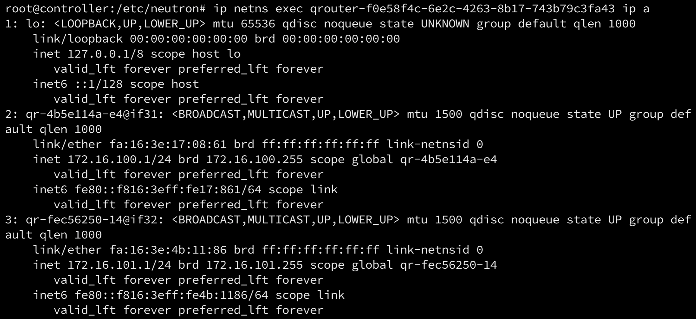

# 0x03_neutron_Routing


不同VLAN之间通过router连通, 路由上配置多个VLAN的网关地址。

## KVM实现 - L3 agent

在控制节点或网络节点运行虚拟router。

!!! note "配置文件：`/etc/neutron/l3_agent.ini`"
    - linux bridge: `interface_driver = neutron.agent.linux.interface.BridgeInterfaceDriver`
    - open vswitch: `interface_driver = neutron.agent.linux.interface.OVSInterfaceDriver`

查看agent列表：`{==neutron agent-list==}`


1. 通过Web GUI创建router

    1. 增加interface, 选择vlan的subnet

    

    

    ```bash hl_lines="6 11"
    $ brctl show
    bridge name     bridge id               STP enabled     interfaces
    brq79f0b942-92  8000.080027f23a45       no              enp0s8.100
                                                            tap1f82ab4e-dd
                                                            tap29389f61-ff
                                                            tap4b5e114a-e4
                                                            tap5118ae25-b9
    brq98e34498-29  8000.080027f23a45       no              enp0s8.3041
                                                            tap1a18cf66-0d
                                                            tap44694333-91
                                                            tapfec56250-14
    virbr0          8000.525400c2314c       yes             virbr0-nic
    ```

    

## 实现原理


> 在bridge上分别增加veth pair连接TAP设备和router {==namespace==} 中的interface。

- 查看router列表：`{==neutron router-list==}`
- 查看namespace:

    ```bash
    $ ip netns
    qrouter-{routerid}
    ```

    

- 查看router中的veth interface配置:

    ```bash
    $ ip netns exec qrouter-{routerid} ip a
    qr-xxx
    ```

    

- 查看router中的路由表：`ip netns exec qrouter-{routrtid} route`

    


!!! quote "已读"
    - [Routing 功能概述 - 每天5分钟玩转 OpenStack（98）](https://mp.weixin.qq.com/s?__biz=MzIwMTM5MjUwMg==&mid=2653587574&idx=1&sn=5471a874e5b5a213856ceec673504031&chksm=8d30806fba47097905040ac439077e43e57021a868e9cef1276219841976a81e2782869661ad&scene=21#wechat_redirect)
    - [配置 L3 agent - 每天5分钟玩转 OpenStack（99）](https://mp.weixin.qq.com/s?__biz=MzIwMTM5MjUwMg==&mid=2653587570&idx=1&sn=7f4341819b1341e4a98cd99e1848a340&chksm=8d30806bba47097d69cdf8de057fe7780ca7070a8efcd1e47572785733628b2f079716c876a5&scene=21#wechat_redirect)
    - [创建 router 连通 subnet- 每天5分钟玩转 OpenStack（100）](https://mp.weixin.qq.com/s?__biz=MzIwMTM5MjUwMg==&mid=2653587565&idx=1&sn=bb68d3487f78e34aad2642264b29176a&chksm=8d308074ba4709629c4a08aa6c6e46b3719d89745b634eed3f9d53f8ab698e0e75edbef74557&scene=21#wechat_redirect)
    - [虚拟 ​router 原理分析- 每天5分钟玩转 OpenStack（101）](https://mp.weixin.qq.com/s?__biz=MzIwMTM5MjUwMg==&mid=2653587562&idx=1&sn=74d5123363eaaadd1f5072cc876ec1ae&chksm=8d308073ba470965a2dd1e9a18be97d25f9ebb6ffd70cfd6d5274fcdedd398dd530842d86bd7&scene=21#wechat_redirect)
