# 0x04_neutron_Routing


不同VLAN之间通过router连通, 路由上配置多个VLAN的网关地址。

## KVM实现 - L3 agent

在控制节点或网络节点运行虚拟router。

!!! note "配置文件：`/etc/neutron/l3_agent.ini`"
    - linux bridge: `interface_driver = neutron.agent.linux.interface.BridgeInterfaceDriver`
    - open vswitch: `interface_driver = neutron.agent.linux.interface.OVSInterfaceDriver`

查看agent列表：`{==neutron agent-list==}`


1. 通过Web GUI创建router

    1. 增加interface, 选择vlan的subnet

    

    

    ```bash hl_lines="6 11"
    $ brctl show
    bridge name     bridge id               STP enabled     interfaces
    brq79f0b942-92  8000.080027f23a45       no              enp0s8.100
                                                            tap1f82ab4e-dd
                                                            tap29389f61-ff
                                                            tap4b5e114a-e4
                                                            tap5118ae25-b9
    brq98e34498-29  8000.080027f23a45       no              enp0s8.3041
                                                            tap1a18cf66-0d
                                                            tap44694333-91
                                                            tapfec56250-14
    virbr0          8000.525400c2314c       yes             virbr0-nic
    ```

    

## Linux Bridge实现原理


在bridge上分别增加veth pair连接TAP设备和router {==namespace==} 中的interface。

> 如果不使用namespace, 多个租户创建的路由条目只能记录到控制节点的路由表中, 会产生重叠

- 查看router列表：`{==neutron router-list==}`
- 查看namespace:

    ```bash
    $ ip netns
    qrouter-{routerid}
    ```

    

- 查看router中的veth interface配置:

    ```bash
    $ ip netns exec qrouter-{routerid} ip a
    qr-xxx
    ```

    

- 查看router中的路由表：`ip netns exec qrouter-{routrtid} route`

    


!!! quote "已读"
    - [Routing 功能概述 - 每天5分钟玩转 OpenStack（98）](https://mp.weixin.qq.com/s?__biz=MzIwMTM5MjUwMg==&mid=2653587574&idx=1&sn=5471a874e5b5a213856ceec673504031&chksm=8d30806fba47097905040ac439077e43e57021a868e9cef1276219841976a81e2782869661ad&scene=21#wechat_redirect)
    - [配置 L3 agent - 每天5分钟玩转 OpenStack（99）](https://mp.weixin.qq.com/s?__biz=MzIwMTM5MjUwMg==&mid=2653587570&idx=1&sn=7f4341819b1341e4a98cd99e1848a340&chksm=8d30806bba47097d69cdf8de057fe7780ca7070a8efcd1e47572785733628b2f079716c876a5&scene=21#wechat_redirect)
    - [创建 router 连通 subnet- 每天5分钟玩转 OpenStack（100）](https://mp.weixin.qq.com/s?__biz=MzIwMTM5MjUwMg==&mid=2653587565&idx=1&sn=bb68d3487f78e34aad2642264b29176a&chksm=8d308074ba4709629c4a08aa6c6e46b3719d89745b634eed3f9d53f8ab698e0e75edbef74557&scene=21#wechat_redirect)
    - [虚拟 ​router 原理分析- 每天5分钟玩转 OpenStack（101）](https://mp.weixin.qq.com/s?__biz=MzIwMTM5MjUwMg==&mid=2653587562&idx=1&sn=74d5123363eaaadd1f5072cc876ec1ae&chksm=8d308073ba470965a2dd1e9a18be97d25f9ebb6ffd70cfd6d5274fcdedd398dd530842d86bd7&scene=21#wechat_redirect)
    - [Why Namespace? - 每天5分钟玩转 OpenStack（102）](https://mp.weixin.qq.com/s?__biz=MzIwMTM5MjUwMg==&mid=2653587558&idx=1&sn=e4381acfef2030b74f870e4f7c3547c6&chksm=8d30807fba4709693926bc849dd4736b47e92e23c3b9d1af215466f524d21c7ec8865a859999&scene=21#wechat_redirect)


## 访问外网

1. 配置网络类型和网卡映射: `/etc/neutron/plugins/ml2/ml2_conf.ini`
    - flat

        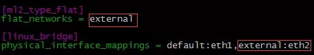

    - vlan

        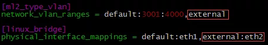

1. 重启neutron服务
1. 通过Web GUI创建外网

    !!! todo "[创建外网 ext_net - 每天5分钟玩转 OpenStack（104）](https://mp.weixin.qq.com/s?__biz=MzIwMTM5MjUwMg==&mid=2653587552&idx=1&sn=f6eff207c135c1d25352e0da88bba175&chksm=8d308079ba47096f20fdda00a19c54764fe1b1f97238bae469771ad0ae06bd0f12348f13ef5c&scene=21#wechat_redirect)"

    1. 勾选 **外部网络**
    1. 填写 **Gateway IP**
    1. 禁用DHCP

1. 查看linux bridge状态: `{==brctl show==}`, 已创建brqXXX并挂载eth2
1. 设置router的Gateway为External Network, 自动增加interface, IP来自外部网络
1. 查看网桥已挂载router的tap

    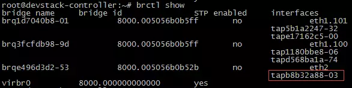

1. namespace中新增qgxxx

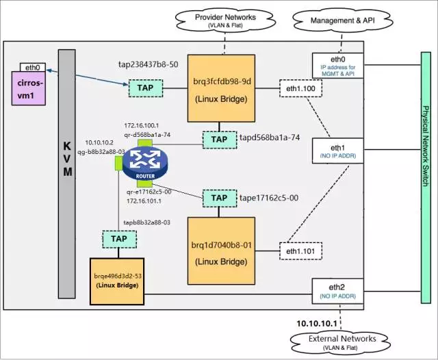

!!! tip "数据包从qgxxx发出的时候会进行SNAT为router的interface地址10.10.10.2"

1. 查看SNAT规则: `ip netns exec qrouter-xxx iptables -t nat -S`

    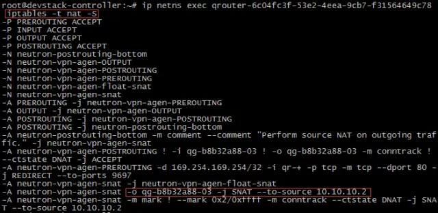

1. tcpdump验证SNAT

    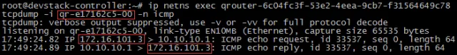

    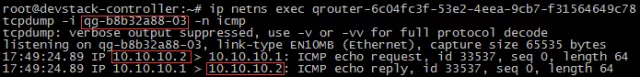


!!! quote "已读"
    - [访问外网 ML2 的配置 - 每天5分钟玩转 OpenStack（103）](https://mp.weixin.qq.com/s?__biz=MzIwMTM5MjUwMg==&mid=2653587553&idx=1&sn=dd4b5ff80e94ba7eb978730f141c8e8e&chksm=8d308078ba47096ebb7b76f882d194c86d576d23fabe1a4b054e22d466104efafe6f64b0f0c6&scene=21#wechat_redirect)
    - [外网访问原理分析 - 每天5分钟玩转 OpenStack（105）](https://mp.weixin.qq.com/s?__biz=MzIwMTM5MjUwMg==&mid=2653587547&idx=1&sn=437882d6c5c24929d0455e41c0b4a226&chksm=8d308042ba470954a45fb20f9cfc3245a94e91a0816238dd54097838eabbbaa148cfc162d436&scene=21#wechat_redirect)


## floating IP

1. 通过webUI创建Floating IPs

    !!! todo "[创建 floating IP - 每天5分钟玩转 OpenStack（106）](https://mp.weixin.qq.com/s?__biz=MzIwMTM5MjUwMg==&mid=2653587542&idx=1&sn=4d209648987ab21349d8ca93af1e370e&chksm=8d30804fba4709599201f35102648fbaaa3165a220fa5a9bccb97d3c633162f9074f7df472c5&scene=21#wechat_redirect)"

1. 在ext_net中Allocate IP, 并Associate到VM
1. 在namespace中查看router的interface qgxxx添加floating IP

    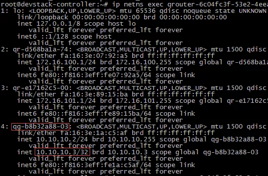

1. 在namespace中查看iptables中的NAT规则

    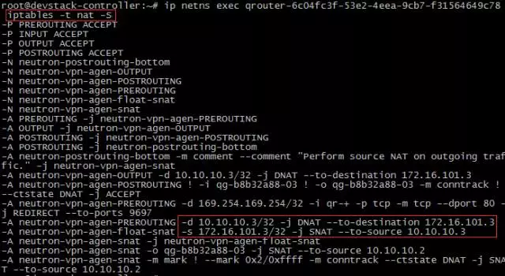

    1. 如果目的地址是10.10.10.3, DNAT为172.16.101.3
    1. 如果源地址是172.16.101.3, SNAT为10.10.10.3

1. tcpdump验证

    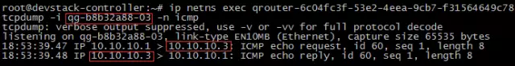

    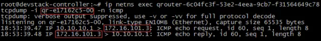

!!! abstract "在 {==router==} 的 {==interface==} 上设置 {==floating IP==}, 并通过 {==iptables==} 配置 {==NAT==}"


!!! quote "已读"
    - [floating IP 原理分析 - 每天5分钟玩转 OpenStack（107）](https://mp.weixin.qq.com/s?__biz=MzIwMTM5MjUwMg==&mid=2653587539&idx=1&sn=b41b18336c593b143e7495660fa2f086&chksm=8d30804aba47095c5ab109d963c7cc88a024c6aed8a75105e32db3e3d5cea846a878b6f12a31&scene=21#wechat_redirect)


## OVS实现原理

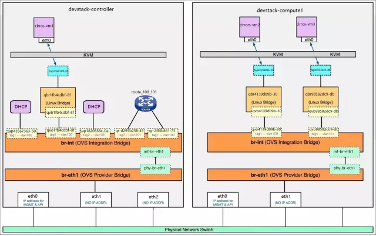

1. 在br-int上新增两个port, 对应router的interface

    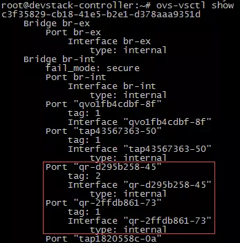

1. 在namespace中配置同样的网络接口

    


!!! quote "已读"
    - [用虚拟 router 连通 subnet - 每天5分钟玩转 OpenStack（141）](http://mp.weixin.qq.com/s?__biz=MzIwMTM5MjUwMg==&mid=2653587417&idx=1&sn=fb9f549de4b0cc4923187b06b8cfbc3f&chksm=8d308fc0ba4706d60d81ef74e2ef8a09879544af0bcb9ceb24871a1e3affe446bd4c026f523e&scene=21#wechat_redirect)
    - [Neutron Router 工作原理 - 每天5分钟玩转 OpenStack（142）](http://mp.weixin.qq.com/s?__biz=MzIwMTM5MjUwMg==&mid=2653587424&idx=1&sn=f7654df4df8652a07f044531abe3b44c&chksm=8d308ff9ba4706efac361c6ced0923b611333a52df92520f5be4c5386d67da08a6f54b4b613c&scene=21#wechat_redirect)


## 访问外网

1. 将eth2挂到br-ex上

    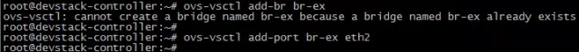

1. 配置外部网络与网桥的映射: `/etc/neutron/plugins/ml2/ml2_conf.ini`

    - flat

        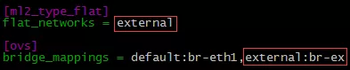

    - vlan

        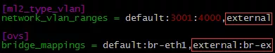

1. 重启neutron
1. 通过webUI创建ext_net

    !!! todo "[创建 OVS 外部网络 ext_net - 每天5分钟玩转 OpenStack（144）](https://mp.weixin.qq.com/s?__biz=MzIwMTM5MjUwMg==&mid=2653587429&idx=1&sn=820d3ea92d3bef94fd98679904ae14d7&chksm=8d308ffcba4706ea268a5fb36b42e9f40cbc884dcc9f7a4b1316c1cfd6065954cb600d3afa26&scene=21#wechat_redirect)"

    1. 勾选 **外部网络**
    1. 填写 **Gateway IP**
    1. 禁用DHCP

1. 执行`ovs-vsctl show`查看已创建patch port连接br-int和br-ex

    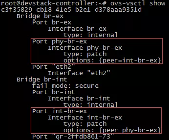

1. 将router Set Gateway为ext_net
    - br-ex自动增加port qgxxx

        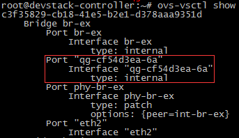

    - namespace中的router自动增加interface qgxxx, IP来自于ext_net

        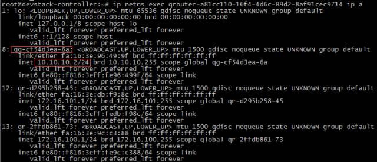

1. namespace路由表中默认网关指向qgxxx

    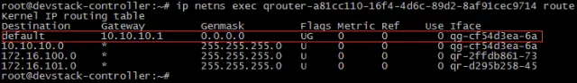

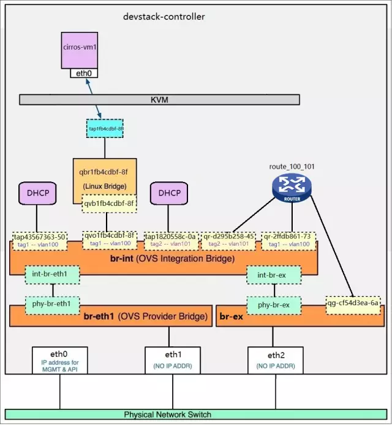


!!! quote "已读"
    - [访问 Neutron 外部网络 - 每天5分钟玩转 OpenStack（143）](https://mp.weixin.qq.com/s?__biz=MzIwMTM5MjUwMg==&mid=2653587427&idx=1&sn=6719232c78d0763c88aedf9b57fdbc46&chksm=8d308ffaba4706ecf4e63f553b66eb269b3e617f2d3e6cac07c05951aec75b3be38211245410&scene=21#wechat_redirect)
    - [将 ext_net 连接到 router - 每天5分钟玩转 OpenStack（145）](https://mp.weixin.qq.com/s?__biz=MzIwMTM5MjUwMg==&mid=2653587432&idx=1&sn=cd9b8bcad85e7caecec1f53d6b283ca6&chksm=8d308ff1ba4706e7e444ac29d3c570b336cb11ab626430188658500efb90e5d5ba94f6690e1a&scene=21#wechat_redirect)
