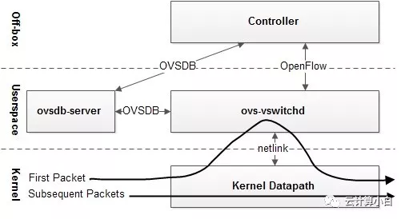
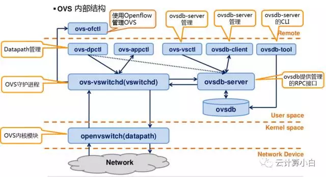
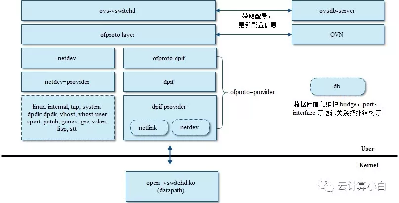

# OVS

Open vSwitch

??? note "名词解释"
    - NIC: 网卡
    - TAP/TUN: Linux内核实现的一对虚拟网络设备, TAP工作在二层, TUN工作在三层。虚拟机的vNIC与TAP相连, 相当于物理机NIC连接eth。

        > 当一个TAP设备被创建时, 在Linux设备文件目录下会生成一个对应的字符设备文件, 用户程序可以像打开普通文件一样对这个文件进行读写。

    - OpenFlow: 流表协议, 用于控制面和数据面通信

## 架构



- 控制面: OpenFlow controller, 管理OVS中的流表, 通过向OVS下发流表规则控制数据流向
- 数据面(转发模块):
    - 用户态: 守护进程ovs-vswitchd, 轻量级数据库服务ovsdb-server
    - 内核态: datapath, 从物理网卡NIC或VM的虚拟网卡vNIC收到包, 第一次交由ovs-vswitchd决定丢弃或从哪个口传出, 并缓存动作

## 组件



- ovs-appctl: OVS守护进程管理

    ```bash
    # 显示OVS版本信息
    $ ovs-appctl version
    ovs-vswitchd (Open vSwitch) 2.7.3
    # 显示支持的所有命令
    $ ovs-appctl list-commands
    ```

- ovs-vsctl: 查询和更新ovs-vswitchd的配置

    ```bash
    # 显示主机上已有的网桥和端口信息
    $ ovs-vsctl show
    # 增加网桥
    $ ovs-vsctl add-br xxx
    # 删除网桥
    $ ovs-vsctl del-br xxx
    ```

- ovs-ofctl: 基于OpenFlow协议对OVS进行监控和管理

    ```bash
    # 查询某个网桥上的端口信息(addr, speed...)
    $ ovs-ofctl show br-xxx
    # 查询某个网桥各端口的统计信息, 包括收发包, 丢包等
    $ ovs-ofctl dump-ports br-xxx
    # 查询某个网桥上所有的流配置
    $ ovs-ofctl dump-flows br-xxx
    ```

- ovs-dpctl: datapath({==虚拟网卡==})管理

    ```bash
    # 显示所有datapath的名称
    $ ovs-dpctl dump-dps
    # 显示所有datapath的基本信息
    $ ovs-dpctl show
    # 显示某个DP的flows
    $ ovs-dpctl dump-flows xxx
    ```

- ovsdb-client: OVS DB JSON-RPC客户端, 需要指定服务器

    ```bash
    # 显示服务器上所有数据库
    $ ovsdb-client list-dbs [SERVER]
    Open_vSwitch
    # 显示数据库中的表信息
    $ ovsdb-client get-schema [SERVER] [DATABASE]
    # 显示所有表名
    $ ovsdb-client list-tables [SERVER] [DATABASE]
    # 显示所有列信息
    $ ovsdb-client list-columns [SERVER] [DATABASE] [TABLE]
    # dump数据库
    $ ovsdb-client dump [SERVER] [DATABASE]
    ```

- ovsdb-tool: OVS DB管理工具

    ```bash
    $ ovsdb-tool db-version
    7.15.1
    ```

## 进程

- ovs-vswitchd
- ovsdb-server



## 数据转发流程


1. datapath接收到某个eth/vnet发来的数据包, 提取源/目的IP, MAC, 端口
1. 匹配快速流表
1. 如果不命中, 通过netlink upcall发给ovs-vswitchd处理
1. 匹配精确流表和模糊流表, 如果不命中, 通过Open Flow协议发给控制器处理
    - 模糊命中: 刷新用户态精确流表和内核态精确流表
    - 精确命中: 刷新内核态流表
1. 重新把数据包注入到datapath查询流表发起选路


!!! quote "参考链接"
    - [从 Bridge 到 OVS，探索虚拟交换机](https://mp.weixin.qq.com/s/2KaHYOxyvZw1B6PhmjN_vw)
    - [OVS 总体架构、源码结构及数据流程全面解析](https://mp.weixin.qq.com/s/p-_ygYnOwSbFSx3fsD7iTQ)
