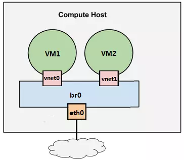

# 网络虚拟化

## Linux Bridge

相当于二层交换机, 负责数据转发, 多个网卡可以连接到同一个Linux Bridge, 当某个网卡接收到数据包时, Linux Bridge会将数据包转发给其他网卡。  



为了让VM可以访问网络，为VM1分配虚拟网卡vnet0（host中的TAP设备）通过Bridge br0与host的eth0相连。

### 配置实现

#### 配置Linux Bridge br0

在HOST上配置文件路径：`/etc/network/interfaces`

```
auto eth0
# 将dhcp获取方式改为manual
iface eth0 inet manual

# 新增网络设备
auto br0
# IP放到br0上
iface br0 inet dhcp
    bridge_stp off
    bridge_waitport 0
    bridge_fd 0
    # 将eth0挂到br0上
    bridge_ports eth0
```

重启HOST生效

!!! note "在HOST上查看bridge配置：`brctl show`"

##### NAT

virbr0是KVM默认创建的bridge, 为虚拟机网卡提供NAT功能。

默认分配一个IP, 并使用dnsmasq为虚拟机提供DHCP服务，在HOST中查看进程：`ps -ef | grep dnsmasq`

在`/var/lib/libvirt/dnsmasq/default.leases`中记录VM成功DHCP的IP

!!! check "使用NAT的VM只能访问外网, 但外网无法访问VM, 因为IP是virbr0 DHCP分配的, 经过了NAT转换"

!!! check "使用br0的VM可以通过自己的IP直接与外网通信"


#### 配置VM

- 方式一: 使用virt-manager图形化界面将VM1的网卡配置为br0。

!!! example "KVM命令行"
    - 查看虚拟机列表：`virsh list --all`  
    - 启动虚拟机：`virsh start VM1`
    - 查看VM接口列表：`virsh domiflist VM1`


!!! quote "已读"
    - [KVM 网络虚拟化基础 - 每天5分钟玩转 OpenStack（9）](https://mp.weixin.qq.com/s?__biz=MzIwMTM5MjUwMg==&mid=2653587933&idx=1&sn=958532f257d5b4ba575f297a0b66db25&chksm=8d3081c4ba4708d2199ddfaa151e93da2905eab86e963f194d1a7f90bb77535e5de5b7f83d52&scene=21#wechat_redirect)
    - [动手实践虚拟网络 - 每天5分钟玩转 OpenStack（10）](https://mp.weixin.qq.com/s?__biz=MzIwMTM5MjUwMg==&mid=2653587932&idx=1&sn=d8442e02c9d19114ed2a64b3375b07f6&chksm=8d3081c5ba4708d326b27352349a01c2f2175c0cc7d56944f40af2fc2c64ffdc9a5548f1b89e&scene=21#wechat_redirect)
    - [理解 virbr0 - 每天5分钟玩转 OpenStack（11）](https://mp.weixin.qq.com/s?__biz=MzIwMTM5MjUwMg==&mid=2653587925&idx=1&sn=13bc307ede2bcbfea15d9e2848680fa4&chksm=8d3081ccba4708da3bb35c13788234640548bcc3d8fb8b880a248c8dcb8bf9a9e6504e804406&scene=21#wechat_redirect)


## VLAN

LAN: 使用Hub或Switch连接，同一个广播域。

VLAN: Switch将端口划分出多个LAN, 相当于将一个交换机分成了多个交换机。

> 不同VLAN在三层网络可以通过路由互通。

交换机的端口有两种配置模式：Access和Trunk。

- Access口：端口属于VLAN，VLAN ID 1~4096。直接与计算机网卡相连，流入该口的数据包都被打上VLAN的标签。
- Trunk口：允许多个VLAN数据通过，通过时不更换VLAN标签。

### 网卡

- 物理网卡eth0: 服务器上实际的网络接口设备eth0, eth1...
- 子网卡eth0:1: 依赖于物理网卡，可以与物理网卡同时存在并使用不同的IP地址，使用自己的网络接口配置文件。{>>与物理网卡同时启用<<}

    !!! info "VIP使用的是子网卡：`ifconfig eth0:0 x.x.x.x netmask 255.255.255.0 up`"

- ==虚拟VLAN 10 网卡eth0.10==: 没有自己的配置文件，通过 ==vconfig== 将物理网加入不同的VLAN自动生成。信息保存位置：`/proc/net/vlan/config`

    !!! info "启用VLAN虚拟网卡时，物理网卡接口上必须没有IP，且不能启用子网卡。"


### ifconfig

/sbin/ifconfig: 查看，配置，启用，禁用网络接口的工具。

!!! warning "通过ifconfig为网卡指定的IP地址，只是用来调试网络用的，不会更改系统关于网卡的配置文件。"

语法：ifconfig 接口 IP hw MAC netmask 掩码 broadcast 广播 [up/down]

- ifconfig -a: 查看所有网络接口状态。
- ifconfig eth0: 查看特定网络接口状态。
- ifconfig eth1 hw ether xx:xx:xx:xx:xx:xx: 设置网卡MAC地址，其中hw后面所接的是网络接口类型：ether表示以太网，其他如ax25, ARCnet, netrom...

!!! quote "参考链接"
    <https://www.cnblogs.com/JohnABC/p/5951340.html>

### KVM实现VLAN


- eth0作为Trunk口, 允许多个VLAN数据通过。
- eth0.10，定义VLAN 10。
- eth0.10, brvlan10, vnet0都接到VLAN 10的Access口上。
- brvlan10上其他网络设备都自动加入到VLAN 10中。

### 配置

在HOST上配置文件路径：`/etc/network/interfaces`

```
# 增加eth0.10
auto eth0.10
iface eth0.10 inet manual
    vlan-raw-device eth0

# brvlan10
auto brvlan10
iface brvlan10 inet manual
    bridge_stp off
    bridge_waitport 0
    bridge_fd 0
    bridge_ports eth0.10

# eth0.20
auto eth0.20
iface eth0.20 inet manual
    vlan-raw-device eth0

# brvlan20
auto brvlan20
iface brvlan20 inet manual
    bridge_stp off
    bridge_waitport 0
    bridge_fd 0
    bridge_ports eth0.20
```

重启HOST生效

!!! note "在HOST上查看bridge配置：`brctl show`"

使用virt-manager分别将VM1, VM2的网卡挂到brvlan10, brvlan20上。

> 通过VLAN隔离后，即使在VM内使用`ifconfig eth0 192.168.100.10 netmask 255.255.255.0 up`配置为同一网段，VM1和VM2也不能互通。  


## 总结

物理交换机可以进行数据交换和隔离。

- Linux Bridge实现交换，将同一VLAN的子设备挂到同一个Bridge上。
- Linux VLAN实现隔离，因为eth0不能拥有同一个VLANID的不同虚拟VLAN网卡。

!!! abstract "Linux Bridge + VLAN = 二层交换机"


!!! quote "已读"
    - [Linux 如何实现 VLAN - 每天5分钟玩转 OpenStack（12）](https://mp.weixin.qq.com/s?__biz=MzIwMTM5MjUwMg==&mid=2653587920&idx=1&sn=79332fb8fd8370b8d6b7d9728c383008&chksm=8d3081c9ba4708df9fcff17839e3c0fbb53a82298799c15ee45889f830a0087a46672505f115&scene=21#wechat_redirect)
    - [动手实践 Linux VLAN - 每天5分钟玩转 OpenStack（13）](https://mp.weixin.qq.com/s?__biz=MzIwMTM5MjUwMg==&mid=2653587914&idx=1&sn=9a584117a38f8b8ef525c3cae109d0c8&chksm=8d3081d3ba4708c56d86224450f47eb8611714ef1b441afe275fc169671bdc6d9ae0494921ff&scene=21#wechat_redirect)
