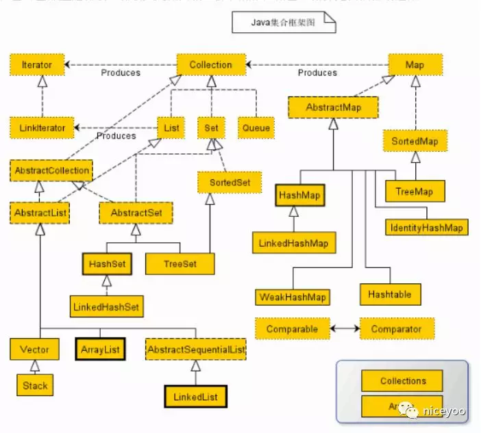

# 0x07_Collection



- java.util.Collection<E>
    - AbstractCollection
    - List
        - AbstractList
            - ArrayList: 数组
            - Vector: 动态数组, **线程同步**
                - Stack

            - LinkedList: 链表

    - Set: **去重**
        - AbstractSet
            - HashSet: 以hashcode和equals方法来判断是否同一个元素
                - LinkedHashSet

            - TreeSet: 以二叉树对插入元素进行 **排序**, 元素需实现Comparable接口并重写compareTo()

        - SortedSet

    - Queue

- Map
    - AbstractMap
        - HashMap: 根据键的hashCode存储数据, 应使用 **ConcurrentHashMap** 保证线程安全, 引入了分段锁, 并发 **优于Hashtable**
            - **长度** 默认 **2的幂**(16)，key:hashcode() --> hash() --> indexFor(){ &len-1 } --> 存储下标，**按位与** 的时候分布均匀
            - LinkedHashMap
            - HashMap采用链地址法解决哈希冲突
                - JDK7
                    - 使用了数组+链表的方式
                    - 插入链表的头部，头插法
                    - ReentrantLock + Segment + HashEntry
                - JDK8
                    - 使用了数组+链表+红黑树（超过8个）的方式
                    - 插入链表的尾部，尾插法
                    - synchronized + CAS + HashEntry + 红黑树

        - Hashtable: 遗留类, 继承自Dictionary, **线程安全**
        - TreeMap: 根据键 **排序**
        - IdentityHashMap
        - WeakHashMap

    - SortedMap

- Iterator
    - LinkIterator

- Comparable
- Comparator
- Collections
- Arrays


!!! quote "参考链接"
    - [Java集合List、Set、Map](https://mp.weixin.qq.com/s/he5d-RsifuqIN3dYc6yc9A)
    - [HashMap和ConcurrentHashMap终于总结清楚了!](https://mp.weixin.qq.com/s/AX9ZgiAtJ88rPmE3qzt1tA)


## ArrayList

```java
List list = new ArrayList<>();
list.add("hello");
// java.lang.IndexOutOfBoundsException: Index: 2, Size: 1
list.add(2, "ok");
// java.lang.IndexOutOfBoundsException: Index: 1, Size: 1
System.out.println(list.get(1));


List list = new ArrayList<>();
list.add("hello");
list.add("world");
// 在指定索引插入元素, 其他元素后移
list.add(1, "my");
// [hello, my, world]
System.out.println(list);
```
