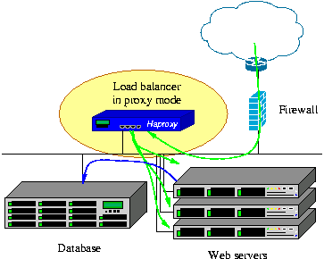

# HAProxy

!!! quote "<https://www.haproxy.org/>"

提供高可用, 负载均衡, TCP/HTTP应用代理, 特别适用于流量较大的web sites



!!! warning "以root启动, 并调用chroot切换"

!!! warning "GPL v2"

## 特性

可基于regex对请求/响应头进行控制(denied, allowed, removed, rewritten, added)

## 安装

1. 下载: `wget https://www.haproxy.org/download/1.8/src/haproxy-1.8.21.tar.gz`
1. 解压: `tar -zxvf haproxy-1.8.21.tar.gz`
1. 编译安装

    ```bash
    # PREFIX指定安装路径
    # TARGET指定当前操作系统内核版本
    # - linux22     for Linux 2.2
    # - linux24     for Linux 2.4 and above (default)
    # - linux24e    for Linux 2.4 with support for a working epoll (> 0.21)
    # - linux26     for Linux 2.6 and above
    # - linux2628   for Linux 2.6.28, 3.x, and above (enables splice and tproxy)
    $ make PREFIX=/opt/haproxy TARGET=linux2628
    $ make install PREFIX=/opt/haproxy
    ```

1. 创建配置文件

    ```bash
    $ vim /opt/haproxy/conf/haproxy.cfg
    global #全局属性
        daemon  #以daemon方式在后台运行
        maxconn 256  #最大同时256连接
        pidfile /home/ha/haproxy/conf/haproxy.pid  #指定保存HAProxy进程号的文件

    defaults #默认参数
        mode http  #http模式
        timeout connect 5000ms  #连接server端超时5s
        timeout client 50000ms  #客户端响应超时50s
        timeout server 50000ms  #server端响应超时50s

    frontend http-in #前端服务http-in
        bind *:8080  #监听8080端口
        default_backend servers  #请求转发至名为"servers"的后端服务

    backend servers #后端服务servers
        server server1 127.0.0.1:8000 maxconn 32  #backend servers中只有一个后端服务，名字叫server1，起在本机的8000端口，HAProxy同时最多向这个服务发起32个连接
    ```


## simpler solution

- [Linux Virtual Servers(LVS)](http://www.linuxvirtualserver.org/): 三层负载均衡, 需要配合[Keepalived](https://www.keepalived.org/) monitor服务器连接状态
- [Ngnix](http://nginx.org/): web server, 代理


!!! quote "参考链接: [HAProxy从零开始到掌握](https://www.jianshu.com/p/c9f6d55288c0)"
