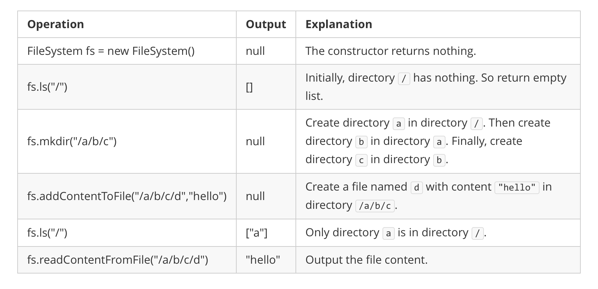

# Memory_File_System

## 功能要求

1. ls
    - 如果是文件路径, 列出文件名
    - 如果是目录路径, 列出目录中的目录和文件名(按照字典排序)
1. mkdir
    - 如果目录不存在, 创建新目录
    - 如果路径中某一目录不存在, 创建
    - 返回void
1. addContentToFile
    - 给定文件路径和文件内容, 如果文件不存在, 创建
    - 如果文件存在, 追加内容
    - 返回void
1. readContentFromFile
    - 给定文件路径, 返回文件内容

## 用例

- Input:

    ["FileSystem","ls","mkdir","addContentToFile","ls","readContentFromFile"]

    [[],["/"],["/a/b/c"],["/a/b/c/d","hello"],["/"],["/a/b/c/d"]]

- Output:

    [null,[],null,null,["a"],"hello"]

## 假设约束

1. 所有路径都以`/`开头, 结尾不带`/`
1. 所有参数都合法, 不会查询不存在的文件或目录
1. 所有的目录和文件名均为小写字母, 同一个目录中不重复

!!! quote "参考链接: [Design In-Memory File System 设计内存文件系统](https://www.cnblogs.com/grandyang/p/6944331.html)"
